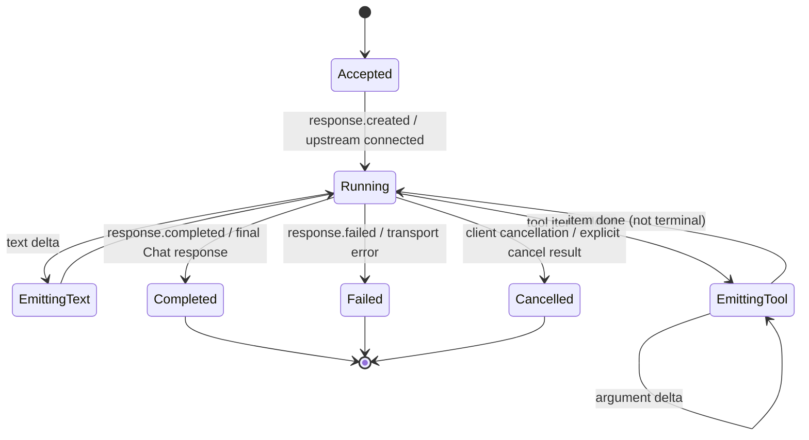

# Chat Completions 与 Responses：转换策略对比及协议/状态转换器设计

## 结论

若目标是实现可靠的 OpenAI Chat Completions <-> Responses proxy，不应把它设计成两个 JSON mapper。应设计为：

```text
Wire request/event
  -> parse + validate
  -> Canonical Conversation IR + Capability Profile + State Ledger
  -> provider request/event adapter
  -> Canonical result/event
  -> target wire renderer
```

Hermes 证明了**为多轮 replay 保存 opaque state**的重要性；LiteLLM 证明了**双向 bridge、provider fallback 和 SSE 事件状态机**必须独立建模；cc-switch 则给出了 Codex agent tool loop 在 `Responses -> Chat -> Responses` 路径中所需的每请求 tool mapping、跨轮 call-group 恢复与 Chat SSE assembler 证据。推荐以 LiteLLM 的双向层次为骨架，以 Hermes 的 issuer-aware continuation state 作为安全要求，并以 cc-switch 的 tool lifecycle 作为 Phase 6 function-tool 切片的实现约束。

本文比较的源码快照：

| 项目 | 提交 | 对此问题的主要角色 |
|---|---|---|
| Hermes Agent | `c48d53413aa2c09f6d5703082361c2754f1d5350` | agent 消费端；内部 Chat 历史编译为 Responses 请求，保留 replay state |
| LiteLLM | `b3d05bd10b9a044ea08a1f1ce0e165ee5ba1ef35` | provider gateway；双向转换和对外 Responses proxy |
| cc-switch | `08710d51fc04843ce217c58749677d84cf62740b` | 本地 agent proxy；Codex Responses 到 Chat/Anthropic 的转换、tool context、tool history 与 SSE 反向组装 |

## 1. 两个项目的策略对比

| 维度 | Hermes Agent | LiteLLM | 对新转换器的建议 |
|---|---|---|---|
| 主内部形状 | Chat 风格 `messages`，附加 Codex metadata | `ModelResponse`/typed Responses object，两边都可作中间层 | 独立定义 Canonical IR；不要把任一 wire DTO 当 domain model |
| 模式选择 | `api_mode` + provider/model/URL 推断 | model metadata + native provider config + flags | 使用显式 `ProtocolMode` 与可观测 `CapabilityProfile` |
| Chat -> Responses | system->instructions，tool/result 转 input items | 同时转换 messages、tools、response_format、reasoning | 两个方向各自实现，不能靠自动序列化 |
| Responses -> Chat | 响应归一化给 agent loop | input/response/SSE 三层均有 mapper | 明确区分 request、final response、stream event 三种转换 |
| 多轮推理 | 持久化 encrypted reasoning 与 issuer，跨 issuer 丢弃 | 保存 reasoning items，但桥更偏 API 兼容 | opaque state 必须有 origin binding 和 replay policy |
| tool identity | 保存 `call_id` + `response_item_id`，必要时确定性生成 | cache/repair tool call，维护 stream output index | 将 `call_id` 设为不可变 correlation key；item id/index 仅为附属键 |
| 流终止 | 内部直读 Responses stream，归一化后复用 agent loop | 明确以 `response.completed` 作为 terminal owner | 终态只能由 protocol terminal event 或 final aggregate 决定 |
| provider 特例 | 深嵌 adapter（xAI/GitHub/Codex） | config/transform/provider 分层 | 将差异迁至 profile/hook，核心状态机只读 capabilities |
| 对外生命周期 | 不实现 Responses resource API | create/get/delete/cancel/background/polling | 若对外声称 Responses 兼容，必须决定资源与 background 语义 |

### 1.1 可直接学习的源码证据

- Hermes 的 mode 路由：`F:/codespace/hermes-agent/agent/agent_init.py:440`。
- Hermes 的 chat history -> Responses `input[]`：`F:/codespace/hermes-agent/agent/codex_responses_adapter.py:313`。
- Hermes 的 issuer-aware opaque reasoning replay：`F:/codespace/hermes-agent/agent/codex_responses_adapter.py:352`。
- Hermes 的 Responses output -> normal form：`F:/codespace/hermes-agent/agent/codex_responses_adapter.py:1109`。
- LiteLLM 的 Chat -> Responses bridge 选择：`F:/codespace/litellm/litellm/main.py:983`、`F:/codespace/litellm/litellm/main.py:5402`。
- LiteLLM 的 Responses -> Chat fallback handler：`F:/codespace/litellm/litellm/responses/litellm_completion_transformation/handler.py:23`。
- LiteLLM 的 Responses SSE -> Chat SSE：`F:/codespace/litellm/litellm/completion_extras/litellm_responses_transformation/transformation.py:1074`。
- LiteLLM 的 Chat SSE -> Responses SSE 状态机：`F:/codespace/litellm/litellm/responses/litellm_completion_transformation/streaming_iterator.py:51`。
- cc-switch 的 Responses request -> Chat request 与 `CodexToolContext`：`F:/codespace/cc-switch/src-tauri/src/proxy/providers/transform_codex_chat.rs:236`、`:260`。
- cc-switch 的跨请求 call-group 恢复：`F:/codespace/cc-switch/src-tauri/src/proxy/providers/codex_chat_history.rs:48`。
- cc-switch 的 Chat SSE -> Responses SSE tool-call assembler：`F:/codespace/cc-switch/src-tauri/src/proxy/providers/streaming_codex_chat.rs:66`、`:335`、`:486`。

## 2. 为什么直接字段改名一定会出错

### 2.1 输入的结构不同

Chat 是 `messages[]` 的 role 序列；Responses 的 `input[]` 是异构 item 流。它可以同时含 message、function call、function call output、reasoning、item reference 和 provider 内置工具项。一个 Chat assistant tool-call message 在 Responses 中可拆成多个 `function_call` item；一个 Responses tool result 有时需要生成 Chat assistant tool-call wrapper 再跟 tool message，才能满足下游 provider 的相邻顺序约束。

LiteLLM 在 Responses->Chat 时合并连续 tool calls 并修复 tool-result 对应关系，见 `F:/codespace/litellm/litellm/responses/litellm_completion_transformation/transformation.py:405`、`:741`。这说明转换存在状态和相邻项依赖。

### 2.2 输出的基数不同

Chat 通常把一次 completion 表达为 `choices[]` 中的一条 assistant message；Responses 把 text、reasoning、多个 tool calls、computer/image/file-search 等表示为独立 `output[]` items。把它压缩回 Chat 时，item 顺序和原生类型可能不可逆。

### 2.3 完成状态不同

Chat 的 `finish_reason` 是结果级摘要；Responses 有 response-level status、item-level status 和事件序列。LiteLLM 将 `stop/tool_calls/function_call` 映射为 completed，`length/content_filter/refusal` 映射为 incomplete：`F:/codespace/litellm/litellm/responses/litellm_completion_transformation/transformation.py:1458`。这只是 emulation policy，不是数学等价。

Hermes 更进一步会检查 reasoning-only、commentary phase 和 server-side `*_call`，见 `F:/codespace/hermes-agent/agent/codex_responses_adapter.py:1431`。因此必须把“是否可继续/是否应执行本地工具/是否终止 stream”建模为独立状态决策。

### 2.4 存在不可迁移的 opaque continuation data

`reasoning.encrypted_content`、provider 签名、server item id 和 `previous_response_id` 都可能绑定模型、账户、连接或 endpoint。Hermes 的跨 issuer 丢弃策略有直接的失败模式依据：不同端点不能解密对方发出的 opaque content，见 `F:/codespace/hermes-agent/agent/codex_responses_adapter.py:352`。

将这些字段视为普通 JSON 并在任意 fallback 间转发，会让一个本来可恢复的模型切换变为后续每轮稳定 400。

## 3. 推荐的 Canonical IR

推荐 IR 保留“协议事实”而非以 Chat 或 Responses 为中心：

```text
ConversationRequest
  request_id, route_id, target_protocol, model, controls
  instructions: optional text
  items: ordered InputItem[]
  tools: ToolDefinition[]
  tool_context: ToolConversionContext?
  continuation: ContinuationRef?

ToolConversionContext                 # per bridge request; never persisted as route config
  source_protocol, target_protocol
  source_tool_id/kind <-> target_tool_name/schema
  target tool name -> original namespace/custom metadata
  call_id policy, conversion notices

InputItem
  kind: message | function_call | function_result | reasoning | builtin_result | reference
  item_id: optional provider item id
  role: optional system | developer | user | assistant | tool
  parts: ContentPart[]
  call_id: optional immutable correlation id
  function: optional {name, arguments_json}
  status: optional queued | in_progress | completed | incomplete | failed | cancelled
  provider_data: opaque, origin-scoped only

CompletionResult
  response_id, status, output: ordered OutputItem[], usage, error

StreamEvent
  sequence, response_id, output_index, item_id, event_kind, payload, terminal
```

关键约束：

- `items` 和 `output` 必须是**有序异构列表**，不能提前扁平为文本。
- `call_id` 是 client tool invocation 与 tool result 的唯一关联键；`item_id`、`response_id`、`output_index` 分别用于对象、response、流排序，不能互换。
- `ToolConversionContext` 在解析 source tools 后、渲染目标 request 前创建，并由 final-response 与 SSE renderer 共享。它记录每个名称扁平化、schema adaptation 或工具种类降级，不能由全局 provider cache 或 route 配置隐式推断。
- `provider_data` 是 typed envelope，至少有 `issuer`、`protocol`、`replay_policy`、`payload`；禁止把它同普通内容一起跨 provider 透传。
- 任何降级必须写入 `ConversionNotice`，例如 `dropped_builtin_tool`、`status_approximated`、`previous_response_id_not_supported`。
- `ConversationRequest` 是已完成认证和路由后的协议内部表示，不承载 `AuthenticatedPrincipal` 或完整 `RouteSnapshot`。这些不可变控制上下文由 converter 外层持有，并在转换前完成授权与 capability 决策；接口边界见[控制面、模型、密钥与可观测性](../architecture/control-plane-models-keys-and-observability.md)。

## 4. 协议转换规则

### 4.1 Chat -> Canonical -> Responses

1. 验证 Chat messages role 与 tool-result 对应关系。
2. system/developer 转为 `instructions` 或保留为 role message；选择应是 endpoint capability，而非全局硬编码。
3. assistant `tool_calls[]` 按出现顺序展开为 function-call items；每个生成的 item 保留原 `tool_call.id` 作为 `call_id`。
4. `role=tool` 转 function-result item；必须有对应 `tool_call_id`/`call_id`，且不可用 message position 或 tool name 猜测关联。
5. chat function tool 解嵌套为 Responses function tool；schema 只按目标 `CapabilityProfile` 的显式规则适配，`null`/缺失/非 object schema 不得由通用 IR 静默修复。
6. 将 `response_format` 转 `text.format`，将 token limit 转 `max_output_tokens`。
7. 仅当 continuation 的 issuer 与当前 endpoint 一致且 capability 支持时 replay opaque item。
8. 通过最终 wire schema validator；未知字段不要默默透传。

这与 Hermes 的 converter/preflight 两阶段做法相符：`F:/codespace/hermes-agent/agent/codex_responses_adapter.py:313`、`:823`。

### 4.2 Responses -> Canonical -> Chat

1. 按原始 `input[]` 顺序解析；不要先按 role group。source tools 解析后立即创建 `ToolConversionContext`，并将它交给 request、final response 与 stream renderer。
2. function call -> assistant tool call；仅合并连续、目标 Chat 可表达的调用。每个调用仍保留独立 `call_id`，并在 `function_call_output` 前 flush 成同一条 assistant message。
3. function call output -> tool message；缺少或无法恢复 `call_id` 时返回显式 validation error，不要猜错关联。若 Chat 上游要求 assistant call 紧邻 tool result，只有 issuer/deployment-bound continuation ledger 命中时才补回完整 call group。
4. Phase 6 的最小 bridge 只支持 function tools。responses-only built-in、custom、namespace 与 tool-search 必须由 capability 明确映射或拒绝；不能按 cc-switch 的 provider 特例静默降级。
5. output[] 的多个 message/tool/reasoning items 按 renderer 规则压缩；在 provider metadata 中保留原 item。
6. 将不可精确表达的 status 映射为一个明确策略，并带 transformation notice。

LiteLLM 对 unsupported built-ins 的告警/丢弃逻辑展示了 capability gate 的必要性：`F:/codespace/litellm/litellm/responses/litellm_completion_transformation/transformation.py:1252`。

## 5. Streaming 状态机

不要把 SSE 当成无状态的逐行 transform。推荐每个请求一个单线程 `StreamAssembly`：



每个 stream state 至少维护：

```text
response_id
next_sequence
output_items_by_index
text_buffer_by_item
reasoning_buffer_by_item
call_id -> {output_index, name, arguments_buffer, item_id}
chat_tool_index -> call_id
pending_tool_calls_by_index
tool_context
terminal_seen
usage
provider_data
```

必须强制的 invariant：

1. `output_item.done` 不是 terminal；协议 SSE 终态仅由 `response.completed`、`response.incomplete`、`response.failed` 或无 stream 的最终 response 决定。client cancellation / explicit cancel result 是独立的本地终态，不应伪装成不存在的 `response.cancelled` SSE terminal。若 provider 缺失 terminal frame，只能进入明确标记的 recovery 分支：要求已收集完整/可验证 output，保留 `terminal_missing` 诊断，且不得伪造正常 lifecycle。Hermes 的恢复逻辑在 `F:/codespace/hermes-agent/agent/codex_runtime.py:1140-1162`，但它默认返回 `status="completed"` 而无此诊断；新实现应改进这一点。
2. 一个 `call_id` 在一次 response 内只能绑定一个 logical tool call；重用 index 但出现不同 call id 时，禁用不安全的 index fallback。
3. terminal event 前必须 flush 已缓冲的 tool argument 与 message item。
4. 终态只能发一次；重复 event idempotent 处理。
5. event 到达顺序以 provider sequence 或接收序号记录，不能用 text 拼接顺序推断。
6. Chat tool delta 的空 id/name fragment 不得覆盖已解析身份；仅在 call id 与 name 均已确定、且较早的连续 index 已可表达时发 `output_item.added`。最终 arguments 在 complete/done 前 canonicalize、parse 并按 target schema validate；不在 partial delta 上解析 JSON。
7. 并行 tool call 的 Responses `output_index` 按 source Chat `index` 的逻辑顺序确定，而非“哪个 call 最先收齐”。不完整或缺 name 的 call 只能明确丢弃/失败并产生 notice，不能污染同一 response 内其他有效 call。

LiteLLM 的 Chat->Responses iterator 已显示 `call_id -> output_index`、argument buffer、pending queue 的必要形态：`F:/codespace/litellm/litellm/responses/litellm_completion_transformation/streaming_iterator.py:71`、`:138`。其反向 iterator 证明 terminal 应归属 `response.completed`：`F:/codespace/litellm/litellm/completion_extras/litellm_responses_transformation/transformation.py:1253`、`:1305`。

## 6. Capability Profile，而不是 provider 名称 if/else

建议每个实际 deployment/route 解析为：

```text
CapabilityProfile
  accepts_chat: bool
  accepts_responses: bool
  supports_streaming: bool
  supports_previous_response_id: native | emulated | none
  supports_opaque_reasoning_replay: bool
  opaque_state_issuer: string
  supported_tool_kinds: set
  supports_builtin_web_search: bool
  supports_background: bool
  supports_response_resource_store: native | proxy | none
  max_item_id_length: optional int
```

它可表达 Hermes 中 GitHub id 不可 replay、xAI 工具 schema 需要清洗、Azure 留在 Chat 等实际差异，而不污染核心转换器。协议 renderer 只读取 capabilities，provider adapter 负责生成 profile。

## 7. 项目 Phase 6 内部的分阶段实现建议

以下 Phase 1–4 仅为协议转换器在项目 Phase 6 内的建议性交付切片，不替代项目级 Phase 0–6 编号或实施顺序。开始这些切片前，应先满足[开发计划](../plans/development-plan.md)中项目 Phase 6 的前置条件。

### Phase 1: 最小可靠文字 + function tool 桥

- 定义上面的 Canonical IR、strict request validator、转换错误模型。
- 支持 system/user/assistant 文本、function tool schema、function call、function result、非流式 usage。
- 保存 `call_id`，拒绝无对应关联的 tool result；将 `item_id`、`response_id` 与 `output_index` 保持为不同字段。
- 在 source tools 解析后创建每请求 `ToolConversionContext`，供 request、final response 和 SSE renderer 共用；Phase 1 不支持 custom/namespace/tool-search 映射。
- 用 fixture 做 Chat->Responses->Chat 与 Responses->Chat->Responses 的语义 round-trip；覆盖连续 calls -> 单一 Chat assistant `tool_calls`、紧邻 tool result 和允许的有损项。

### Phase 2: 正确的双向 SSE

- 实现两个独立 iterator；一条处理 Chat delta -> Responses events，另一条处理 Responses events -> Chat chunks。
- 添加并行 tools、文字后 tools、tools 后文字、arguments 分片、late/empty id/name delta、终态/错误/取消、usage 的 fixture。
- 断言 Chat `index` 与 Responses `output_index` 的稳定排序，argument buffer 只在 done 时 JSON parse/canonicalize，且 `output_item.done` 不结束 response。
- 先交付 deterministic event ordering，再做 token 分片模拟。

### Phase 3: continuation 和 provider capabilities

- 引入 `ContinuationRef` 与 issuer/deployment-bound continuation ledger，保存 ordered call group、route snapshot version 与 expiry。
- 实现 `previous_response_id` 的 native/emulated/unsupported 明确策略；emulated 恢复只允许同 issuer + 同 deployment 命中，禁止 cc-switch 式全局 unique-`call_id` fallback。
- 用 capability profile 控制 builtin tools、file search、background、schema quirks。
- 为每次降级写 trace/log/response metadata，便于调用方调试。

### Phase 4: 对外 Responses resource 语义

- 仅在已定义存储边界后实现 GET/DELETE/input_items/cancel/background；不能仅伪造 response id。
- 确定 `store` 是直通、proxy-managed 还是拒绝，并为每种情况定义权限、TTL、清理与重启恢复。

## 8. 不变量与测试清单

至少建立这些 tests：

| 类别 | 断言 |
|---|---|
| 信息完整性 | text、image/file part、tool name/arguments/call_id、usage、annotation 的预期保存/降级被记录 |
| tool 关联 | 并行多个 calls 能以同一 call_id 收到各自 result；没有 call_id 的 result 被拒绝 |
| tool context | 每请求 tool name/schema/kind mapping 同时用于 request、final response 与 SSE；unknown/builtin tool 的 map/reject/notice 可断言 |
| continuation | 同 issuer opaque token 可 replay；不同 issuer/不支持 endpoint 一定不会发出 |
| continuation call group | `previous_response_id` 只在同 issuer/deployment、未过期的 ledger 中补回完整 assistant call group；跨 route、歧义 call id 或缺失 ledger 一定不猜测恢复 |
| status | text stop、tool calls、length、filter、failed、cancelled、reasoning-only 的 policy 固定 |
| stream | item done 不结束；completed 才结束；末尾先 flush 缓冲工具参数；并行 index 有序、空 id/name 不覆盖已解析身份、终态只一次 |
| fallback | Native Responses、Chat bridge、无能力拒绝三条路径产出可区分 metadata |
| resource | background/poll/get/delete/cancel 不与 transient stream state 混用 |

本地验证证据：Hermes adapter test 为 `27 passed`，LiteLLM bridge test 为 `45 passed`；具体命令和范围见 [Hermes Agent 协议分析](../research/hermes/chat-responses-analysis.md) 与 [LiteLLM 协议分析](../research/litellm/chat-responses-analysis.md)。

## 9. 最终推荐

采用“**Canonical item log + 双向 renderer + per-request stream assembly + issuer-bound continuation ledger + capability profiles**”。

不要采用“请求字段 rename + 响应字段 rename”的方案。它能通过最简单的文本 demo，但会在第二轮 tool result、reasoning replay、并行 tool stream、provider fallback 或 background response 上破坏状态关联，而且故障通常表现为下一轮 400、静默丢工具调用或过早结束流。双向 bridge 还必须有 re-entry guard，避免 Responses fallback 到 Chat 后又因模型规则被转回 Responses；LiteLLM 以 `_skip_responses_api_bridge` 实现该约束：`F:/codespace/litellm/litellm/responses/litellm_completion_transformation/handler.py:62`。