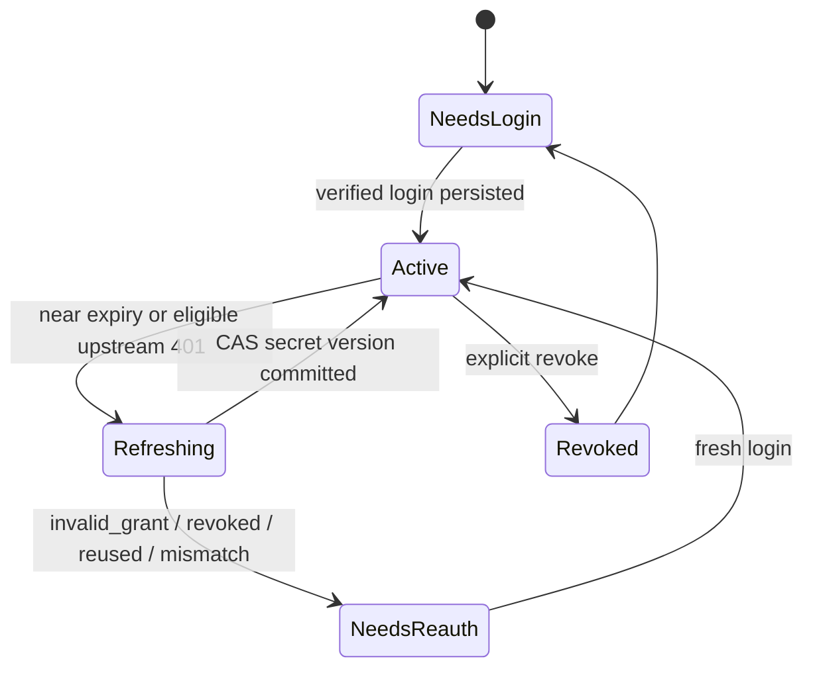

# Codex OAuth：proxy 自主管理凭证的边界与实施前验证

## 1. 结论

本项目的已确认目标是：**不通过 Codex CLI 中转；proxy 自己完成登录、加密存储 credential，并 refresh token。** 当前每个 provider 只维护一个 active credential，不考虑同 provider 的多账号、多 workspace、多 credential 选路或 credential pool。

这会把客户端迁移负担集中到 proxy，但也把 OAuth 协议漂移、token rotation、secret storage、撤销和合规责任集中到 proxy。Codex CLI 的实现可用于学习 PKCE、storage 与 refresh state machine；它不是可直接复制为生产 OAuth client 的授权。

真实 OAuth client registration、redirect URI、scope/resource、token endpoint、refresh 行为和适用条款是 **Phase 2 的硬门**。如果无法确认，真实 Codex OAuth 接入必须暂停；不得退回到导入 `auth.json`、复用未确认的 Codex CLI 内部 client ID/endpoint，或将 Codex CLI 作为中转依赖。

## 2. 范围和非目标

### 当前范围

```text
Provider ── 1:1 ── ActiveCredential
                    └─ Deployment(s)
```

- proxy 发起 browser authorization-code + PKCE login；device code 仅在确认支持后加入。
- proxy 在 secret vault 中保存 access/refresh token，以 secret reference + version 供 provider adapter 使用。
- proxy refresh token、处理 rotation、进入 `NeedsReauth`、提供 revoke/re-login。
- 任何上游认证头仅由 provider adapter 在调用前短时构造。

### 当前非目标

- Codex CLI 的 login、auth cache 或 refresh 中转。
- 导入、复制或上传 `~/.codex/auth.json`。
- 同 provider 多 credential、多 token 轮换、多账号/工作区路由或按 credential 负载均衡。
- 将 proxy 实现为 `auth.openai.com` OAuth issuer、browser MITM 或通用 OAuth relay。
- 把 Codex OAuth token 当作下游 client 的 proxy API key。

## 3. Credential 与 secret 边界

```text
ProviderCredential
  provider_id                    // unique: one active credential per provider
  kind: oauth | api_key
  issuer
  account_ref                    // non-secret fingerprint only
  scopes / resource              // provider-specific metadata
  state: NeedsLogin | Active | Refreshing | NeedsReauth | Revoked
  expires_at
  secret_ref                     // vault entry, not token value
  secret_version
  refreshed_at
  last_error_code
```

数据库或配置层对 `provider_id` 必须设唯一约束。不要为未来多 credential 提前增加 selector、priority、weight、fallback 或 collection；当前 adapter 只取该 provider 的一个 active binding。

- 普通 database、日志、trace、queue、error 和管理 API 不保存或返回 access token、refresh token、authorization code、完整 callback URL query。
- token 采用 envelope encryption 或 secret manager 保存；服务进程仅在 provider adapter 构造上游请求时临时解密。
- `account_ref` 仅用于审计、账户切换检测和显式 binding；不要把未经验证的 JWT payload 当作授权依据。
- issuer、resource/audience、deployment allowlist 与 provider 必须绑定；token 不得被转发到 client 指定的任意 URL 或其他 provider。

## 4. 登录流程

### 4.1 默认：browser authorization-code + PKCE

```text
POST admin/providers/{provider}/credential/login
  → LoginSession(id, provider_id, state, sealed_pkce_verifier, expires_at)
  → authorization URL

GET admin/oauth/callback/{provider}
  → validate state + provider + redirect policy
  → exchange code once
  → write encrypted secret version
  → credential state = Active
  → emit metadata-only audit event
```

必须满足：

- 使用 PKCE S256；`state` 必须高熵、单次、短 TTL，并绑定发起管理员会话与 provider。
- callback URI 仅允许预注册 HTTPS 地址；本地开发 loopback callback 必须显式开启，且不得监听所有接口。
- authorization code、verifier、state、access/refresh token 不出现在常规日志或 callback response。
- 登录成功后校验 issuer、目标 account/workspace（如真实契约提供）和 deployment binding，再激活 credential。

### 4.2 Device code：条件支持

仅当真实 provider 的 device-code 契约、client registration 与适用条款确认后实现。它必须遵循 server interval、`slow_down`、denied、expired、timeout 和用户取消语义。未确认前不调用或仿造 Codex CLI 的私有 `/api/accounts/deviceauth/*` 路径。

## 5. Refresh 与状态机



规则：

1. 每个 provider 一把 refresh lock；当前没有 credential selection 或多锁调度。
2. refresh 以 secret version compare-and-swap 提交；旧 refresh result 不能覆盖新登录/新 refresh。
3. access token 近过期时预刷新。上游 401 最多触发一次受控 refresh，并且仅在下游尚未输出业务 SSE event 时重试原请求。
4. `invalid_grant`、refresh token reused/invalidated/expired、issuer/account mismatch 进入 `NeedsReauth`；停止自动 refresh，要求管理员重新登录。
5. revoke/logout 删除或禁用 vault secret，失效 provider client cache，并写 metadata-only audit event。

## 6. 最小管理接口

```text
GET  /admin/providers/{provider}/credential/status
POST /admin/providers/{provider}/credential/login
GET  /admin/oauth/callback/{provider}
POST /admin/providers/{provider}/credential/revoke
```

status 只包含 provider、credential state、account fingerprint、expiry、last refresh time、last error code 和 config version；不得输出 secret、token、authorization code 或 vault content。

管理接口需要独立于后续 client API key 的 admin authorization；在 Phase 2 前只能运行于受信本地/私网环境。

## 7. 验证门

### Mock issuer

| 场景 | 必须断言 |
|---|---|
| authorization-code success | state、PKCE verifier、issuer、redirect URI 被验证；secret 仅进入 vault |
| state replay / expiry | 拒绝且不创建/覆盖 credential |
| issuer / redirect substitution | 拒绝 |
| refresh rotation | 新 secret version 生效；旧版本不能覆盖 |
| concurrent refresh | 一个 provider 同一时间只有一次 token endpoint call |
| `invalid_grant` / reused / revoked | 进入 `NeedsReauth`，不无限 retry |
| revoke | secret 不可再取用，adapter cache 失效 |
| observability | log、trace、error、DB 均无 OAuth material |

### 真实 OAuth preflight

进入真实 OAuth 实现前，必须确认：

- 可用于自建 proxy 的 OAuth client registration / client ID；
- 允许的 redirect URI、issuer、authorization/token endpoint、scope/resource；
- refresh token 的 rotation、expiry、revocation 与账户/workspace 行为；
- token audience 是否只可用于预期 deployment；
- 账户、workspace、组织和服务条款是否允许此 credential-owner 模式。

没有明确、适用的答案时，真实 integration 是阻塞项，不得用 CLI 内部实现细节绕过。

## 8. Codex 源码参考与风险

已核对 `openai/codex@0fb559f0f6e231a88ac02ea002d3ecd248e2b515`：

- [PKCE](https://github.com/openai/codex/blob/0fb559f0f6e231a88ac02ea002d3ecd248e2b515/codex-rs/login/src/pkce.rs#L12-L26)：64-byte verifier、S256 challenge。
- [browser callback / state](https://github.com/openai/codex/blob/0fb559f0f6e231a88ac02ea002d3ecd248e2b515/codex-rs/login/src/server.rs#L329-L391)：loopback callback 与 state check。
- [token exchange](https://github.com/openai/codex/blob/0fb559f0f6e231a88ac02ea002d3ecd248e2b515/codex-rs/login/src/server.rs#L784-L857)：authorization code + verifier exchange。
- [device code](https://github.com/openai/codex/blob/0fb559f0f6e231a88ac02ea002d3ecd248e2b515/codex-rs/login/src/device_code_auth.rs#L62-L146)：仅作协议参考。
- [storage](https://github.com/openai/codex/blob/0fb559f0f6e231a88ac02ea002d3ecd248e2b515/codex-rs/login/src/auth/storage.rs#L38-L61)：`auth.json`、keyring/file/ephemeral storage。
- [refresh lock](https://github.com/openai/codex/blob/0fb559f0f6e231a88ac02ea002d3ecd248e2b515/codex-rs/login/src/auth/manager.rs#L2362-L2455)：single-flight refresh 与永久失败缓存。

这些实现说明需要 PKCE、短时 state、secret storage、单飞 refresh、rotation protection 与 re-login 状态；但 client ID、私有 device endpoints、scope、claims 和 backend header 会随 Codex 演进，不能视作稳定公开接口。

## 9. 一手参考

- Codex authentication：https://developers.openai.com/codex/auth
- OAuth 2.0 Security Best Current Practice：https://datatracker.ietf.org/doc/html/rfc9700
- PKCE：https://datatracker.ietf.org/doc/html/rfc7636
- Codex source：https://github.com/openai/codex
