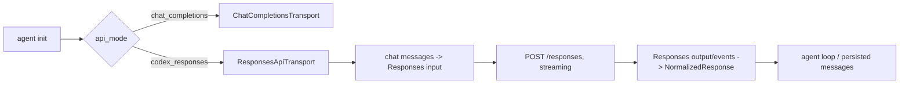

# Hermes Agent: Chat Completions 与 Responses 分析

## 范围与证据

本文只分析本地 `F:/codespace/hermes-agent` 的当前源码快照：`main` 分支，提交 `c48d53413aa2c09f6d5703082361c2754f1d5350`。这里的 `codex_responses` 是 Hermes 对 OpenAI Responses 及若干兼容端点的内部模式名；它不是一个对外 HTTP proxy 路由。

关键结论：Hermes 的稳定内部会话历史仍是 chat 风格 `messages`，但在选中 `codex_responses` 时将其编译为 Responses `input[]`，并在返回时归一化回 agent loop 需要的 assistant/tool-call 形状。它为不能在 Chat 模式中表达的状态额外保存了 `codex_reasoning_items`、`codex_message_items`、`call_id` 与 `response_item_id`。

## 1. 模式选择和调用路径



- 显式 `api_mode` 优先；否则 `openai-codex`、`xai`/`xai-oauth`、特定 `chatgpt.com/backend-api/codex` URL 都选 `codex_responses`。其他 OpenAI-compatible 默认 `chat_completions`：`agent/agent_init.py:440`。
- 未显式指定时，直接 OpenAI URL 或 provider/model 判定为必须使用 Responses 的模型会把原本 Chat 模式升级为 `codex_responses`；Azure URL 被明确排除：`agent/agent_init.py:527`。
- `build_api_kwargs()` 定义于 `agent/chat_completion_helpers.py:855`；在 `codex_responses` 分支（`:896`）调用 transport 的 `build_kwargs()`，而 Chat 走另一套 transport builder。
- 流式入口把 Codex/Responses 委托回内部 `_interruptible_api_call()` 的专用流处理，最终仍返回与非流式兼容的对象，避免主 agent loop 分叉：`agent/chat_completion_helpers.py:2049`、`agent/chat_completion_helpers.py:2077`。

这是一种“**内部逻辑统一，wire format 按端点选择**”的实现，而不是让业务层同时理解两份协议。

## 2. Chat 风格历史如何编译为 Responses 请求

### 2.1 请求骨架

`ResponsesApiTransport.build_kwargs()` 提取首个 system message 为顶层 `instructions`，其余消息放进 `input`，强制 `store=False`：`agent/transports/codex.py:146`、`agent/transports/codex.py:257`。最终的 preflight 还要求 `model`、`instructions`、`input` 都存在，并拒绝 `store != false`：`agent/codex_responses_adapter.py:823`。

| Chat/internal 概念 | Responses wire 形状 | 证据 |
|---|---|---|
| `system` | 顶层 `instructions`；不会进入 `input[]` | `agent/transports/codex.py:146`；`agent/codex_responses_adapter.py:372` |
| 普通 `user` | `{role:"user", content}`，多模态部分为 `input_*` | `agent/codex_responses_adapter.py:555` |
| 普通 `assistant` | `{role:"assistant", content}` 或原始 `message` item | `agent/codex_responses_adapter.py:498` |
| assistant `tool_calls[]` | 每个调用一个 `{type:"function_call", call_id, name, arguments}` | `agent/codex_responses_adapter.py:512` |
| `role:"tool"` | `{type:"function_call_output", call_id, output}` | `agent/codex_responses_adapter.py:563` |
| Chat function schema | Responses `{type:"function", name, description, strict:false, parameters}` | `agent/codex_responses_adapter.py:244` |

请求构造后还会以白名单做结构校验与清洗，例如 tool type、`call_id`、`arguments`、item id 和未知顶层字段：`agent/codex_responses_adapter.py:603`、`agent/codex_responses_adapter.py:823`。因此 adapter 不是简单 JSON rename，而是协议边界的 validator。

### 2.2 工具调用的关联键不能丢

Chat 的 tool result 用 `tool_call_id` 关联，Responses 使用 `function_call.call_id` 与 `function_call_output.call_id`。Hermes 的转换策略是：

1. 尝试从已有 `call_id` 或封装过的 id 取回真实关联键；
2. 若缺失才用函数名、参数和位置生成确定性 id；
3. 将 Responses 的 item id 与 call id 都保存在内部 tool call 上；
4. 下一轮从 `role:"tool"` 重新变为 `function_call_output`。

见 `agent/codex_responses_adapter.py:522`、`agent/codex_responses_adapter.py:547`、`agent/codex_responses_adapter.py:590`，以及归一化时保留 `response_item_id` 的 `agent/codex_responses_adapter.py:1296`。这避免了一个常见错误：把 item id、call id 和 stream index 当成同一种 id。

### 2.3 Chat 无法自然承载的状态

Hermes 没有试图把下列信息硬塞进可见 assistant 文本，而是以附加内部字段持久化：

- `codex_reasoning_items`：含 `encrypted_content`、可选 summary、issuer 标记的 reasoning item；
- `codex_message_items`：含 Responses assistant message 的 `id`、`phase`、`status` 与 `output_text` 的原始结构；
- tool call 上的 `call_id` / `response_item_id`。

写入内部 assistant message 的位置在 `agent/chat_completion_helpers.py:1269-1271` 和 `:1276-1278`。这正是多轮正确性与 prompt cache 的载体，而不是展示字段。

## 3. 回复归一化及多轮状态

`_normalize_codex_response()` 把 Responses `output[]` 归一化为一个 assistant-message-like 对象和 `finish_reason`：`agent/codex_responses_adapter.py:1109`。`ResponsesApiTransport.normalize_response()` 再转成统一的 `NormalizedResponse`，并把不可公开解释的保留状态放到 `provider_data`：`agent/transports/codex.py:416`。

### 3.1 item 到 agent 语义的映射

| Responses output item | 归一化目标 | 重要处理 |
|---|---|---|
| `message` | `assistant_message.content` | `commentary`/`analysis` phase 进入 reasoning，不混入最终正文；原 item 仍保存以便 replay。`agent/codex_responses_adapter.py:1223` |
| `reasoning` | `assistant_message.reasoning` + `codex_reasoning_items` | 保存 opaque `encrypted_content`、summary、issuer；跳过临时 `rs_tmp_*`。`agent/codex_responses_adapter.py:1260` |
| `function_call` / `custom_tool_call` | Chat-style `tool_calls` | 同时保留 call 与 response item id。`agent/codex_responses_adapter.py:1296` |
| provider 原生 `*_call` | 不作为 client tool call | 对 xAI server-side tool 的残留 `in_progress` 不误判整个 turn 未完成。`agent/codex_responses_adapter.py:1181` |

### 3.2 reasoning replay 的安全边界

`encrypted_content` 不是普通可迁移文本，而是由 issuing endpoint 封装的 opaque continuation state。Hermes 采取两级保护：

- 会话级开关：某 relay 返回 `invalid_encrypted_content` 后，后续请求完全不 replay reasoning；`agent/codex_responses_adapter.py:334`。
- item 级 issuer guard：若历史 item 的 `_issuer_kind` 与当前端点不同则丢弃该 item，避免 model/provider 切换后使整次请求 400；`agent/codex_responses_adapter.py:352`、`agent/codex_responses_adapter.py:405`。

另外，重放 encrypted reasoning 时会剥掉 Responses item `id` 和 Hermes 内部 `_issuer_kind`；前者在 `store=false` 下不可由服务端查找，后者不是 wire schema：`agent/codex_responses_adapter.py:428`。

相反，普通 assistant `message` item 的短 id、phase、status 尽量被重放以维持 prefix cache；过长 id 被删除，GitHub/Copilot 更是完全不重放 message id：`agent/codex_responses_adapter.py:444`。这是“按字段的可移植性”而非“整条消息可否重放”的策略。

### 3.3 完成状态不是简单 `status == completed`

归一化的完成判断考虑 response-level status、每个输出 item、是否有结构化 tool call、content filter、commentary phase 和 reasoning-only 情形：`agent/codex_responses_adapter.py:1431`。

特别重要的规则：

- `tool_calls` 优先得到 `finish_reason="tool_calls"`；
- `status=incomplete` 且 reason 为 content filter 映射为 `content_filter`；
- message 或普通模型 item 仍是 `in_progress` 时映射为 `incomplete`；
- 某些 provider 的 server-side `web_search_call` 虽残留 `in_progress`，但当 response 已完成且有最终 message 时不应触发 continuation；
- Codex/xAI/GitHub 的 reasoning-only turn 被判为 `incomplete`，让上层 continuation 继续；普通未知 relay 在 response 完成时可接受 reasoning-only 为 stop。

这说明 completion 需是一个**基于 item 分类的判定函数**，不能只复制顶层字段。

## 4. 流式模式的含义

Chat Completions 的终止信号通常附着在最后一个 `choices[].finish_reason`；Responses 是事件序列和聚合 `response` 的组合。Hermes 针对 `codex_responses` 直接消费 Responses stream，再归一化给既有 agent loop，而不是先伪造 Chat SSE：`agent/chat_completion_helpers.py:2052`。

更具体地，`_consume_codex_event_stream()` 直接读取 `responses.create(stream=True)` 的 SSE，以 `response.output_item.done` 累积完整 output。Hermes 仅把 `response.completed`、`response.incomplete`、`response.failed` 识别为 SSE terminal（`agent/codex_runtime.py:864-868`、`:1104-1135`），并由其补齐 response id、status、usage、error 与 `incomplete_details`。若 terminal frame 缺失但已经获得可用 output/text，Hermes 会默认以 `status="completed"` 返回；只有无 output 时才报错（`:978`、`:1140-1162`）。这条降级路径没有 `terminal_missing` 诊断，因而与正常成功不可区分；新 proxy 应把它作为需要改进的行为，显式记录受限恢复而非伪造正常 lifecycle。

对于一个要同时支持两种协议的 proxy，值得继承的 Hermes 原则是：

1. stream adapter 应拥有累积状态：当前 response、output item、tool call、argument buffer、reasoning buffer；
2. 仅在看到协议定义的 terminal event 或整体 response 后给终态；
3. UI token callback、持久化消息、下一轮 replay state 要分开；
4. 返回一个统一 completion result，以避免执行 tool loop 的上层代码知道 endpoint 细节。

## 5. Hermes 的优点、边界和可复用结论

### 可复用设计

- 一个 transport 接口封装 mode-specific build、normalize 与 preflight：`agent/transports/codex.py:90`、`agent/transports/codex.py:416`。
- 在持久层保存可 round-trip 的 opaque/provider state，不把它显示为文本。
- 先转换、后 preflight；因此内部允许丰富表示，外部 wire contract 仍严格。
- 以 provider capability/issuer 标识驱动小范围兼容逻辑，而不是把所有服务都假设为 OpenAI 原生实现。

### 不宜原样照搬的部分

- `codex_responses` 名称同时覆盖 Codex、xAI、GitHub 与 custom relay；新 proxy 应使用更明确的 `ProtocolMode.Responses` 和 `EndpointCapabilities`。
- converter 含较多针对具体 provider 的兼容分支；新实现应将其拆为 capability profile 和小型 transform hook，避免核心状态机被 provider 特例淹没。
- Hermes 是消费端 agent，`store=false` 与 session transcript 的选择服务于其产品需求；对外 proxy 必须独立设计 `store`、GET/DELETE response 和 background task 的语义。

## 6. 学习用的最小测试矩阵

本地源码已有 `tests/agent/test_codex_responses_adapter.py`。在本快照执行：

```bash
uv run --extra dev pytest -q tests/agent/test_codex_responses_adapter.py
```

本次在文中记录的源码提交上复核为 `27 passed`；执行耗时取决于本机环境，不作为稳定证据记录。

建议你的转换器至少覆盖：system-only、text/multimodal message、并行 tool calls、tool result、reasoning opaque token 的同 issuer replay/跨 issuer 丢弃、过长 item id、content filter、reasoning-only、server-side tool 残留状态、stream 中止与无输出恢复。后者不在本节的 adapter 测试文件中；Hermes 的 terminal 缺失恢复测试位于 `tests/run_agent/test_run_agent_codex_responses.py:625`。
