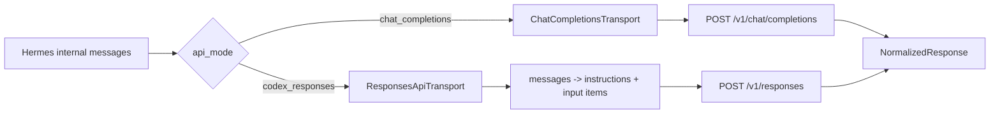

# Hermes Agent：Chat Completions 与 Responses 上游请求合同

## 范围与证据

- 调研对象：`NousResearch/hermes-agent` 的 `main`，固定提交
  [`a31be48030f60383bf4c1d96ba46bd4b48430218`](https://github.com/NousResearch/hermes-agent/tree/a31be48030f60383bf4c1d96ba46bd4b48430218)，
  本地 checkout 于 2026-08-11 获取并确认与 `origin/main` 一致；`pyproject.toml` 仍标记版本 `0.20.0`。
- 本文研究 Hermes 主 Agent 的 `chat_completions` 与 `codex_responses` 两条 OpenAI-compatible 上游路径。Anthropic Messages、
  Bedrock、MoA 内部 fan-out、auxiliary model 和 provider 自定义 middleware 不属于本文的默认请求合同。
- “JSON 字段”指上游最终收到的 request body。OpenAI Python SDK 的 `timeout` 是客户端传输参数，`extra_headers` 是 HTTP header，
  `extra_body` 中的成员会合并进最终 JSON；三者不能都当作字面 body 字段。
- 本次结论来自最新版源码和对应测试的静态复核，没有启动 Hermes、读取私有配置、调用真实 Provider 或执行负载测试。

主要证据入口：

- [Chat request builder](https://github.com/NousResearch/hermes-agent/blob/a31be48030f60383bf4c1d96ba46bd4b48430218/agent/transports/chat_completions.py#L356-L747)
  与 [Chat physical streaming call](https://github.com/NousResearch/hermes-agent/blob/a31be48030f60383bf4c1d96ba46bd4b48430218/agent/chat_completion_helpers.py#L3285-L3308)；
- [Responses request builder](https://github.com/NousResearch/hermes-agent/blob/a31be48030f60383bf4c1d96ba46bd4b48430218/agent/transports/codex.py#L223-L554)、
  [closed preflight](https://github.com/NousResearch/hermes-agent/blob/a31be48030f60383bf4c1d96ba46bd4b48430218/agent/codex_responses_adapter.py#L944-L1163)
  与 [Responses physical streaming call](https://github.com/NousResearch/hermes-agent/blob/a31be48030f60383bf4c1d96ba46bd4b48430218/agent/codex_runtime.py#L1245-L1290)；
- [mode selection](https://github.com/NousResearch/hermes-agent/blob/a31be48030f60383bf4c1d96ba46bd4b48430218/agent/agent_init.py#L637-L744)
  与 [plain custom mode guard](https://github.com/NousResearch/hermes-agent/blob/a31be48030f60383bf4c1d96ba46bd4b48430218/hermes_cli/runtime_provider.py#L174-L200)。

关键结论：Hermes 没有一份 Chat/Responses 共用的请求超集。Chat 的稳定内部会话历史是 `messages[]`；Responses mode 会把它编译为
`instructions + input[]`，并强制使用无服务端存储的流式请求。兼容网关必须分别按 endpoint 验证，不能因为接受了一个 endpoint 的同名
字段就推断另一条路径兼容。

## 1. 模式选择与实际调用路径



- 显式 `api_mode` 优先。`openai-codex`、xAI 和已识别的 Codex backend 自动选择 `codex_responses`；其他普通
  OpenAI-compatible endpoint 默认走 `chat_completions`。
- GPT-5/OpenAI 自动升级只在未显式指定 mode 时发生，并有 Azure、custom、Copilot 等例外。
- legacy/plain `provider: custom` 对非 OpenAI/xAI URL 保守地忽略持久化的 `codex_responses`。自研网关若要稳定测试 Responses，
  应通过带自身 `api_mode` 的命名 provider 配置或直接构造时的显式 mode 进入该路径，不能依赖模型名猜测。
- Chat 最终调用 `client.chat.completions.create(**kwargs)`；Responses 最终调用
  `client.responses.create(stream=True, **kwargs)`。`codex_responses` 是 Hermes 的内部 transport 名，不是上游 URL。

## 2. Chat Completions 发往上游的字段

### 2.1 核心与条件字段

| 最终 JSON 字段 | 发送条件 | Hermes 语义 |
|---|---|---|
| `model` | 始终 | 当前上游模型 id |
| `messages` | 始终 | 清理 Hermes 私有 sidecar 后的 Chat 历史 |
| `tools` | 有至少一个工具时 | 保持 Chat function wrapper；部分 Provider 会先收窄 JSON Schema |
| `temperature` | Provider profile 固定，或 profile/调用方显式提供时 | 不存在全局默认值；部分模型明确省略 |
| `max_tokens` 或 `max_completion_tokens` | 用户、临时调用或 Provider profile 给出 output cap 时 | 二选一；GPT-4o/4.1/5、o1/o3/o4 等模型族选择 `max_completion_tokens` |
| `reasoning_effort` | Provider profile 与 reasoning 配置要求时 | 值和是否发送都依赖 Provider；不是所有 Chat 请求的公共字段 |
| `think` 等 `extra_body` 成员 | 特定 Provider profile 或 request override 要求时 | SDK 将成员合并到最终 body；例如 custom profile 关闭 reasoning 时可发 `think:false` |
| `prompt_cache_key` | profile 明确声明支持且调用方未覆盖时 | 由首个 system/developer message、tools 与 session scope 生成 `pck_...` 内容哈希；普通 custom profile 默认不发 |
| `stream` | 进入 Chat streaming 物理调用时 | 固定为 `true` |
| `stream_options` | Chat streaming 且不是 native Gemini endpoint | 固定为 `{"include_usage":true}` |

Provider profile 还可以加入 OpenRouter `provider`/`plugins`、Nous `tags`/`session_id`、Qwen metadata 或其他专用字段；
`request_overrides` 与 LLM request middleware 也可以改变请求。因此 Chat 没有一份封闭的全 Provider 顶层字段集合。验证一个普通
OpenAI-compatible 网关时，应先固定 Hermes provider 配置，再记录实际 wire，不能把某个官方 Provider 的专用字段算作 Hermes 全局必需项。

`timeout` 会传给 SDK/httpx，但不是 JSON 字段。Chat 默认也不会为了“无状态”而发送 `store:false`；`store` 只会来自显式 override，
不属于 Hermes Chat 基线。

### 2.2 普通网关的关键流式形状

排除 Provider 专用 override 后，最小物理 Chat 流请求至少包含：

```json
{
  "model": "public-model-id",
  "messages": [
    {"role": "user", "content": "hello"}
  ],
  "stream": true,
  "stream_options": {
    "include_usage": true
  }
}
```

真实 Agent 通常还会带 `tools`，并可能带 output cap 或 reasoning 字段。对于 `provider: custom` profile，未配置 output cap 时该 profile
当前有 `65536` 的默认 cap；最终键仍按模型族选择 `max_tokens` 或 `max_completion_tokens`。命名 provider 或其他 profile 可以不同，
所以这两个 cap 字段是高频条件字段，而不是所有请求的硬性必发字段。

Hermes 不只是要求网关接受 `stream_options`。它会从 `choices:[]` 的 usage-only 尾块读取 `usage`；完整兼容需要在 `[DONE]` 前返回该
尾块。仅静默吞掉请求字段但不产生尾部 usage，不能履行 Hermes 依赖的语义。native Gemini 是源码中的明确例外：Hermes仍发
`stream:true`，但省略 `stream_options`。

### 2.3 Chat 默认不要求的字段

普通 Hermes Chat builder 不会默认发送 `store`、`user`、`metadata`、`response_format`、`top_p`、`tool_choice`、
`parallel_tool_calls` 或 `stream_options.include_obfuscation`。这些字段若出现，应归因到具体 profile、override 或 middleware，不能据此扩大
Hermes 基线。

## 3. Responses 发往上游的字段

### 3.1 普通非 xAI/GitHub/Codex relay 的默认形状

`ResponsesApiTransport.build_kwargs()` 始终构造 `model`、`instructions`、`input` 与 `store:false`。主 Agent 的物理调用无论 UI
是否消费增量，最终都由 `run_codex_stream()` 加入 `stream:true` 并调用 `responses.create()`；Hermes 不给 Responses 发送 Chat 的
`stream_options`。

在默认 reasoning 开启、允许 replay、且 Hermes 暴露至少一个工具时，普通 OpenAI-compatible Responses relay 会看到接近下列形状：

```json
{
  "model": "public-model-id",
  "instructions": "system prompt",
  "input": [
    {"role": "user", "content": "hello"}
  ],
  "store": false,
  "tools": [
    {
      "type": "function",
      "name": "terminal",
      "description": "Run a command",
      "strict": false,
      "parameters": {"type": "object", "properties": {}}
    }
  ],
  "tool_choice": "auto",
  "parallel_tool_calls": true,
  "prompt_cache_key": "pck_<24 lowercase hex characters>",
  "reasoning": {
    "effort": "medium",
    "summary": "auto"
  },
  "include": [
    "reasoning.encrypted_content"
  ],
  "stream": true
}
```

这是普通 relay 的高价值兼容基线，不是每次请求都逐字相同：system prompt、input、tools、cache key 和 model 都会随会话变化，
reasoning effort 也可由配置覆盖。

### 3.2 字段矩阵

| 最终 JSON 字段 | 发送条件 | Hermes 语义 |
|---|---|---|
| `model` | 始终 | 非空模型 id；preflight 必需 |
| `instructions` | 始终 | 首个 system message；缺失或空白时回退到 Hermes 默认 identity |
| `input` | 始终 | Chat 历史转换后的 Responses item 列表；preflight 必需 |
| `store` | 始终 | 必须精确为 `false`；其他值在 Hermes 本地 preflight 失败 |
| `stream` | 物理调用时始终 | runtime 在最终调用前固定加入 `true` |
| `tools` | 转换后至少一个工具时 | Responses function tools 或受支持的 Provider built-in tools；无工具时整个字段省略 |
| `tool_choice` | 与非空 `tools` 同时 | 固定为 `"auto"` |
| `parallel_tool_calls` | 与非空 `tools` 同时 | 固定为 `true` |
| `prompt_cache_key` | 普通非 GitHub、非 xAI relay | 由于 `instructions` 总是非空，正常请求会生成 `pck_` + SHA-256 前 24 hex；总长受限到 64 |
| `reasoning` | reasoning 开启时 | 普通 relay 默认为 `{"effort":"medium","summary":"auto"}`；effort 可配置/按 Provider clamp |
| `include` | 普通 relay | replay 开启时为 `["reasoning.encrypted_content"]`；关闭 replay 或关闭 reasoning 时通常为 `[]` |
| `max_output_tokens` | 用户配置了 `max_tokens` 且不是 Codex backend 时 | Responses output cap；不继承 Chat custom profile 的 `65536` 默认 |
| `temperature` | request override 提供数值时 | builder 无普通 relay 默认值 |
| `service_tier` | fast mode 或 override 要求时 | xAI 会显式删除；普通 relay/Codex 可保留 |
| `prompt_cache_retention` | Bedrock Mantle 的特定模型或 override 要求时 | 自动值当前为 `"24h"`；普通自研 relay 默认不发 |
| `context_management` | 已判定可做 native compaction 的 direct OpenAI/Codex GPT-5.6 请求 | 普通自研 relay 默认不发 |
| Provider 专用 body 字段 | xAI 或显式 `extra_body` 时 | 例如 xAI 的 body-level `prompt_cache_key`；不属于普通 relay 基线 |

`timeout` 和 `extra_headers` 会保留在 SDK kwargs 中，但分别控制本地 HTTP 超时与实际 HTTP header，不是 JSON body。Codex backend
可增加 `session_id`/`x-client-request-id` headers，xAI 可增加 `x-grok-conv-id`；普通自研 relay 默认没有这些专用 header。

### 3.3 Responses 的封闭 preflight 与明确非字段

最终 preflight 的允许集合是：

```text
model, instructions, input, tools, store,
reasoning, include, max_output_tokens, temperature,
tool_choice, parallel_tool_calls,
prompt_cache_key, prompt_cache_retention,
service_tier, context_management,
extra_headers, extra_body, timeout
```

runtime 随后才加入 `stream:true`。未知键会在发起上游请求前失败；因此当前主 Responses path 不会发送
`stream_options`、`previous_response_id`、`background`、`metadata`、`user`、`safety_identifier`、`truncation` 或顶层 `text`。
`store:true` 同样不可能通过 preflight。不要把 OpenAI Responses 完整公开 schema 误当成 Hermes 当前 consumer 的字段集合。

## 4. Chat 历史如何编译为 Responses input

| Chat/internal 概念 | Responses wire 形状 |
|---|---|
| 首个 `system` message | 顶层 `instructions`；不进入 `input[]` |
| 普通 `user` | `{role:"user", content}`；多模态 part 转为 `input_*` |
| 普通 `assistant` | `{role:"assistant", content}` 或可 replay 的原始 `message` item |
| assistant `tool_calls[]` | 每个调用一个 `{type:"function_call", call_id, name, arguments}` |
| `role:"tool"` | `{type:"function_call_output", call_id, output}` |
| Chat function schema | Responses `{type:"function", name, description, strict:false, parameters}` |

转换后还会以白名单校验和清理 item/tool 结构，所以该 adapter 不是简单 JSON rename。Chat 的 `tool_call_id` 必须映射为
Responses `function_call.call_id` 与 `function_call_output.call_id`；Hermes 同时保留 response item id，避免把 item id、call id 与
stream index 混为一谈。

Chat 无法自然承载的 Responses 状态以内部 sidecar 保存：

- `codex_reasoning_items`：opaque `encrypted_content`、summary 与 issuer 标记；
- `codex_message_items`：Responses assistant message 的 id、phase、status 与 content 结构；
- tool call 的 `call_id` 与 `response_item_id`。

这些字段供下一轮转换使用，不会原样泄漏到 Chat 上游。`encrypted_content` 只在相同 issuer 边界内 replay；切换 endpoint/provider 时会
丢弃 foreign-issuer reasoning。replay 时还会剥掉 reasoning item id 和 Hermes 私有 issuer 标记，因为 `store:false` 请求不能依赖服务端
按旧 item id 查找。

## 5. 回复归一化与流终态

Hermes 将两种上游响应都归一化为 agent loop 使用的 assistant content、reasoning、tool calls、finish reason、usage 与 provider sidecar。
Responses output 的重要映射包括：

| Responses output item | 归一化目标 | 关键处理 |
|---|---|---|
| `message` | assistant content | commentary/analysis phase 不混入最终正文；原 item 可保留供 replay |
| `reasoning` | reasoning + `codex_reasoning_items` | 保存 opaque encrypted content、summary 与 issuer |
| `function_call` / `custom_tool_call` | Chat-style tool calls | 同时保留 call id 和 response item id |
| Provider 原生 `*_call` | Provider-owned state | 不自动伪装成 Hermes client tool |

Chat stream 从 `choices[].delta` 累积正文、reasoning 与 tool arguments，并单独读取 `choices:[]` usage 尾块。Responses stream 直接消费
typed event，不先伪造 Chat SSE；当前物理入口使用低层 `responses.create(stream=True)`。

Hermes 只把 `response.completed`、`response.incomplete` 与 `response.failed` 视为 Responses terminal event。若流没有 terminal 但已经
累积到可用 output，当前实现仍回退成 `status="completed"`；无 output 才报错。这是 Hermes 的容错行为，不是上游协议保证。兼容网关的
确定性测试仍应返回合法 terminal，并分别覆盖 usage、tool item、incomplete 与 failed，而不是依赖该降级路径掩盖缺失终态。

## 6. 面向兼容网关的验证优先级

以下是由 Hermes consumer 行为直接导出的请求/响应合同，不是对任何网关当前实现状态的判断：

1. Chat streaming：精确接收 `stream:true + stream_options.include_usage:true`，普通 chunk、finish、usage-only chunk、`[DONE]`
   顺序完整；再覆盖工具调用与 tool result 下一轮。
2. Responses ordinary relay：精确接收 `store:false + stream:true + prompt_cache_key`，并覆盖默认
   `reasoning.effort=medium`、`reasoning.summary=auto`、`include:["reasoning.encrypted_content"]`。
3. Responses tools：有工具时同时接收扁平 function tool、`tool_choice:"auto"` 与 `parallel_tool_calls:true`；无工具时三者全部省略。
4. Responses no-op/配置分支：reasoning 或 replay 关闭后的 `include:[]`、配置后的不同 effort、可选 `max_output_tokens`，以及未知字段的
   zero-egress 拒绝。
5. 多轮状态：function call/output 的 `call_id` round-trip、同 issuer encrypted reasoning replay、跨 issuer 丢弃与 `store:false` 下的
   item-id 处理。
6. Provider 专用 xAI/GitHub/Codex headers、cache placement、native tool 和 context management 应作为独立 profile 测试，不能混进普通
   OpenAI-compatible relay 的最低兼容结论。

静态 builder/preflight 测试只能证明 Hermes 会构造或拒绝哪些 kwargs；fake server 可以证明 wire 与解析合同。只有使用固定 Hermes
checkout、脱敏配置和真实网关 endpoint 的外部验收，才能证明当前部署没有被 provider profile、request override、middleware、模型能力或
SDK 版本改变。
