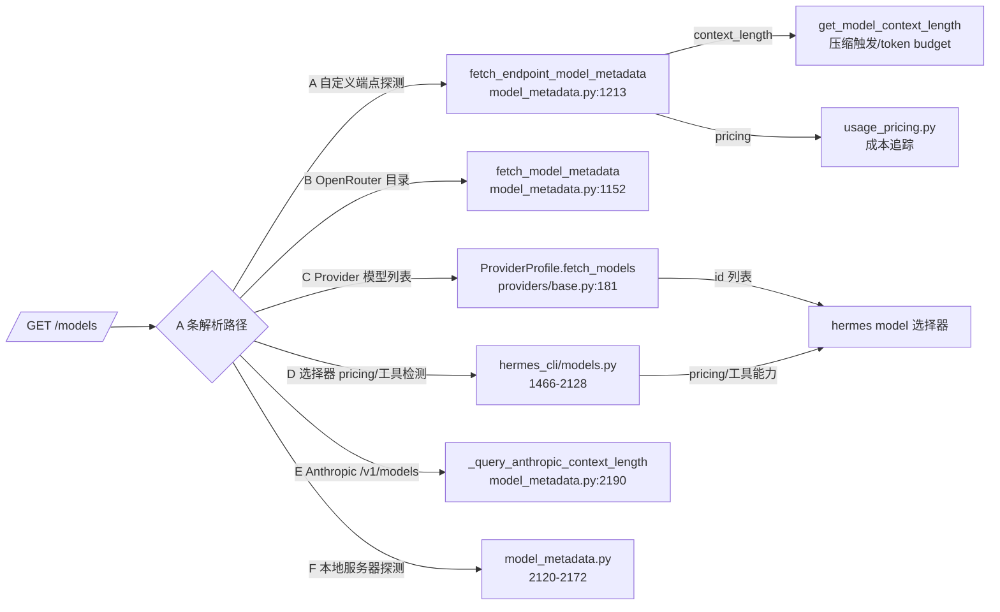

# Hermes Agent：从 /models 端点获取的完整 Schema

## 范围与证据

- 调研对象：Hermes Agent 本机安装版本 `v0.20.0 (2026.8.3)`，安装目录 `C:\Users\IceblueSakura\AppData\Local\hermes\hermes-agent`。
- 阅读范围：`agent/model_metadata.py`、`providers/base.py`、`hermes_cli/models.py`、`agent/usage_pricing.py` 中所有解析 `/models` 响应（或同类模型目录）的代码路径。
- 本文是**外部客户端事实**：Hermes 作为 OpenAI 兼容网关的下游消费者，从 `/models` 读取哪些字段、各字段单位与消费效果。不构成 OpenBridge 的功能承诺。
- 动态事实（provider 目录字段、默认值）为 2026-08-08 阅读快照；升级 Hermes 后须重新复核行号与行为。

关键结论：**Hermes 没有单一 schema 定义**。同一个 `/models` 响应被至少 6 条独立解析路径按各自需要提取字段；`id` 是唯一必需字段，其余全部可选，且缺失时各有 fallback 或宽松放行策略。

## 1. 消费路径总览



### 路径 A：`fetch_endpoint_model_metadata`（自定义端点探测）—— **OpenBridge 网关走这里**

`agent/model_metadata.py:1213`。条件：base_url 不是 openrouter.ai（`_is_openrouter_base_url`），即任何自定义/未知端点。

- 请求：`GET {base_url}/models`，Bearer 认证，超时 (5, 10)，5 分钟内存 TTL（`_ENDPOINT_MODEL_CACHE_TTL = 300`）；base_url 以 `/v1` 结尾时额外尝试去掉 `/v1` 的后缀。
- 响应形状：必须 `{"data": [...]}`（LM Studio 本地分支例外，见下）。
- 提取字段：`id`（必需）、`name`、`context_length`、`max_completion_tokens`、`pricing`、`owned_by`（仅用于识别 llama.cpp）。
- 匹配规则（`_resolve_endpoint_context_length:1394`）：先精确 `id` 相等；只有 1 个模型时用唯一条目；否则子串匹配（`model in key or key in model`）。
- 模型名含 `/` 时自动注册 bare 别名（`_add_model_aliases:1145`，如 `openai/gpt-4o` → `gpt-4o`）。
- 失败时缓存空 dict，5 秒后重试。

### 路径 B：`fetch_model_metadata`（OpenRouter 目录）

`agent/model_metadata.py:1152`。`GET https://openrouter.ai/api/v1/models`，1 小时 TTL。仅当 base_url 匹配 openrouter.ai 时消费。

- 提取：`context_length`（缺省 128000）、`top_provider.max_completion_tokens`（缺省 4096）、`name`、`pricing`、`canonical_slug`（别名）。

### 路径 C：`ProviderProfile.fetch_models`（Provider 模型列表）

`providers/base.py:181`。`hermes model` 选择器/列表调用（`hermes_cli/models.py:3023`）。

- **只取 `id` 列表**，不读其他任何字段。
- 响应形状：`{"data": [...]}` 或顶层数组均可。
- URL 解析顺序：`models_url`（显式覆盖）→ 调用方 base_url → `base_url + "/models"`。
- 消费方：与静态 `_PROVIDER_MODELS` 合并展示。

### 路径 D：模型选择器 pricing/工具能力检测

`hermes_cli/models.py:1466-2128`。适用于任何 OpenRouter 兼容端点（含自定义网关）。

- `_openrouter_model_supports_tools:1476`：读 `supported_parameters`，不含 `"tools"` 时从选择器隐藏；**字段缺失时宽松放行**（不隐藏）。
- `_openrouter_model_is_free:1466`：`pricing.prompt == 0 && pricing.completion == 0`。
- 通用 pricing 抓取（1815-1881）：读 `pricing.{prompt, completion, input_cache_read, input_cache_write}`，转字符串展示；`include_sale_original` 时（Nous Portal 专用）读嵌套 `pricing.original.{prompt, completion, input_cache_read, input_cache_write}`。
- Nous Portal 形状（~1905）：`pricing.{input, output, input_cache_read, input_cache_write}`。
- novita 形状（`_fetch_novita_pricing:2072`）：顶层 `input_token_price_per_m` / `output_token_price_per_m`（$/M，除以 1e10 转每 token）。
- deepinfra 形状（`_fetch_deepinfra_pricing:4554`）：`metadata.pricing.{input_tokens, output_tokens, cache_read_tokens}`（$/MTok，除以 1e6 转每 token）。

### 路径 E：Anthropic /v1/models

`agent/model_metadata.py:2190`。`GET /v1/models?limit=1000`，头 `x-api-key` + `anthropic-version: 2023-06-01`；OAuth token（`sk-ant-oat*`）401 跳过。提取 `max_input_tokens`。仅 API-key 用户。

### 路径 F：本地服务器探测

`agent/model_metadata.py:2120-2172`。用于 localhost/内网端点（vLLM、llama.cpp、Ollama）。

- vLLM `/models`（2133）：`max_model_len` / `context_length` / `max_tokens`。
- 通用匹配（2158-2169）：条目顶层或 `meta` 嵌套内，依次读 `n_ctx`、`context_length`、`context_window`、`max_model_len`、`max_context_length`、`max_tokens`、`n_ctx_train`。
- llama.cpp 单模型服务器：配置名与返回 id 不匹配时 fallback 到唯一条目。

## 2. 完整 Schema（拼接所有路径）

### 顶层

| 字段 | 类型 | 消费路径 | 说明 |
|---|---|---|---|
| `data` | array | A/B/C/D/E/F | 标准形状，所有路径 |
| `models` | array | A（仅 LM Studio） | LM Studio 本地分支专用 |
| （顶层即数组） | array | C | 仅 `fetch_models` 接受 |

### 模型条目（`data[]`）

| 字段 | 类型 | 必需 | 消费路径 | 效果 |
|---|---|---|---|---|
| `id` | string | ✅ | 全部 | 条目 key；匹配；模型选择器显示 |
| `name` | string | 否 | A | 展示，缺省 = `id` |
| `context_length` | int | 否 | A/F/B | **压缩触发、token budget、启动最小窗口检查、`/model` 与 `/info` 显示**（有别名，见下） |
| `max_completion_tokens` | int | 否 | A/B | 提取但**当前无直接消费方**（v0.20.0） |
| `pricing` | object | 否 | A/D/B | 成本追踪、`/cost`、选择器免费标记（形状见下） |
| `owned_by` | string | 否 | A | 值含 `llamacpp` → 额外探测 `/v1/props`（或 `/props`），用 `default_generation_settings.n_ctx` **覆盖**该模型窗口 |
| `supported_parameters` | array | 否 | D | 不含 `"tools"` 时从 OpenRouter 选择器隐藏；缺失宽松放行 |
| `top_provider.max_completion_tokens` | int | 否 | B | OpenRouter 目录缺省 max（缺省 4096） |
| `canonical_slug` | string | 否 | B | 注册别名 |
| `max_input_tokens` | int | 否 | E | Anthropic 专用 |
| `meta`（嵌套） | object | 否 | F | 本地探测：`meta.n_ctx` 等 7 个 key |
| `key` + `loaded_instances[].config.context_length` | — | 否 | A（LM Studio） | LM Studio 专用 |
| `input_token_price_per_m` | number | 否 | D（novita） | 顶层，$/M |
| `metadata.pricing.{input_tokens, output_tokens, cache_read_tokens}` | number | 否 | D（deepinfra） | 嵌套，$/MTok |

### `context_length` 的别名 key（路径 A/F 提取，`_CONTEXT_LENGTH_KEYS:609`）

`context_length`、`context_window`、`context_size`、`max_context_length`、`max_position_embeddings`、`max_model_len`、`max_input_tokens`、`max_sequence_length`、`max_seq_len`、`n_ctx_train`、`n_ctx`、`ctx_size`

### `max_completion_tokens` 的别名 key（`_MAX_COMPLETION_KEYS:624`）

`max_completion_tokens`、`max_output_tokens`、`max_tokens`

### `pricing` 的三种形状（路径 A，递归任意嵌套 + 大小写不敏感别名）

1. **OpenAI 兼容**（每 token 字符串/数字）：
   - input：`prompt` / `input` / `input_cost_per_token` / `prompt_token_cost`
   - output：`completion` / `output` / `output_cost_per_token` / `completion_token_cost`
   - 固定费：`request` / `request_cost`
   - cache read：`cache_read` / `cached_prompt` / `input_cache_read` / `cache_read_cost_per_token`
   - cache write：`cache_write` / `cache_creation` / `input_cache_write` / `cache_write_cost_per_token`
2. **novita**（$/M）：顶层 `input_token_price_per_m`、`output_token_price_per_m`
3. **deepinfra**（$/MTok）：`metadata.pricing.{input_tokens, output_tokens, cache_read_tokens}`

## 3. 推荐 Schema（OpenBridge 网关）

针对 OpenAI 兼容聚合网关的最小完整实现（同时服务路径 A/C/D 的读取）：

```json
{
  "data": [
    {
      "id": "deepseek-chat",
      "name": "DeepSeek Chat",
      "context_length": 131072,
      "pricing": {
        "prompt": "0.00000027",
        "completion": "0.00000110",
        "input_cache_read": "0.00000007",
        "input_cache_write": "0.00000110"
      }
    }
  ]
}
```

要点：

1. **`id` 必带**，缺失条目整条被跳过。
2. **`context_length` 带实际窗口**（任一别名即可，推荐标准名）。缺失时 Hermes 走探测失败 fallback（256K），压缩时机错配：配小浪费、配大超限。
3. **`pricing` 单位是"每 token"**：路径 A 的 `_pricing_entry_from_metadata`（`usage_pricing.py:1131`）会把值乘以 1e6 换算成每百万 token 成本。若按每百万 token 单位上报，成本会差 100 万倍。字符串或数字均可。
4. **不要设置 `owned_by: "llamacpp"`**（除非真的跑 llama.cpp）——会触发 `/v1/props` 额外请求。
5. `max_completion_tokens` 可带可不带（当前无人消费，无害）。
6. `supported_parameters` 建议带 `["tools", ...]`：选择器只在显式列表缺失 `"tools"` 时隐藏，带上有益无害；缺失也行（宽松放行）。
7. 模型名含 `/`（如 `openai/gpt-4o`）时 Hermes 自动注册 bare 别名，匹配更宽松；若不想让裸名可被选到，用不含 `/` 的纯 id。

## 4. 单位与坑（观察事实）

| 项 | 事实 | 后果 |
|---|---|---|
| pricing 单位 | 每 token（OpenAI 兼容形状） | 报成每百万 token 会致成本偏差 1e6 倍 |
| context 探测缓存 | 进程内 300 秒 | 扩容后最多 5 分钟生效，或重启立即生效 |
| context 持久缓存 | `context_length_cache.yaml`（`HERMES_HOME` 下），仅 novita/local/ollama/Bedrock 分支写入 | 自定义端点探测结果**不落盘**，不会被污染 |
| 静态覆盖优先级 | `model.context_length` / `custom_providers[].models.<id>.context_length` 高于所有探测 | 一旦配置永久挡住动态探测 |
| 探测失败 | 返回 256K 默认 + 日志提示 | 网关不可达时不崩，但压缩行为错误 |

## 5. 适用边界与未验证项

- 本文行号固定于本机 `v0.20.0`；references/README.md 登记的旧 checkout commit（`470cf66b`）与本机安装目录不是同一快照，引用行号前须以安装目录源码为准。
- 未验证：`max_completion_tokens` 在后续版本是否开始被消费；OpenRouter 目录实际返回的 `supported_parameters` 枚举值（`tools` 之外还有哪些）；LM Studio 分支在真实 LM Studio 服务上的表现。
- 未覆盖：Hermes 对其他模型信息源（models.dev、Codex OAuth `/models`、Nous Portal）的读取——这些不是 OpenAI 兼容 `/models` 端点。
