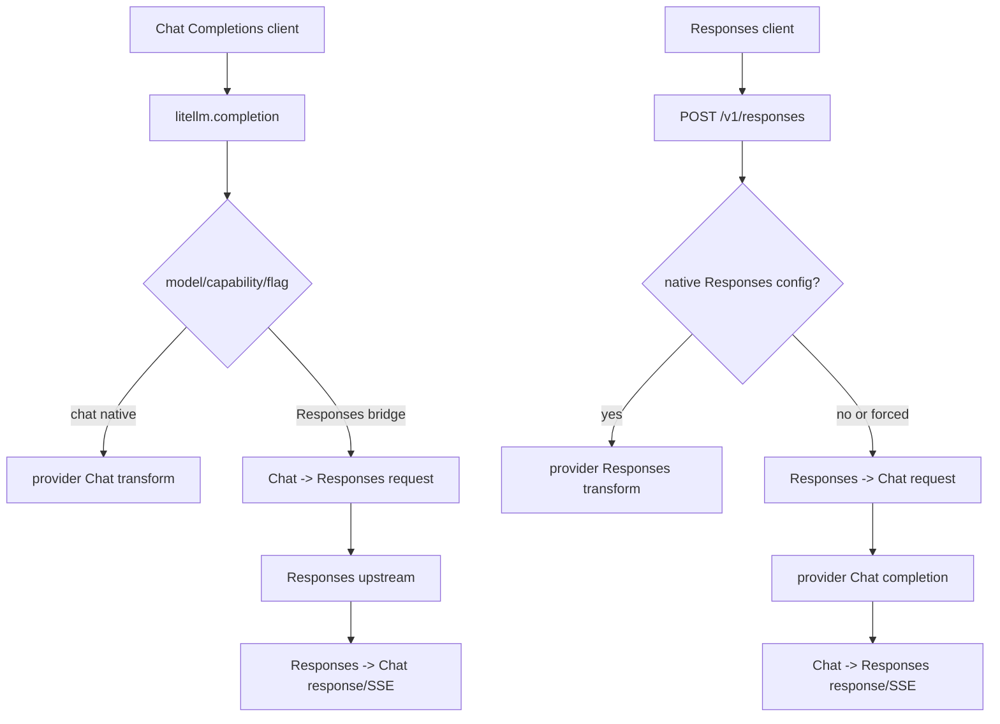

# LiteLLM: Chat Completions 与 Responses 分析

## 范围与证据

本文只分析本地 `F:/codespace/litellm` 的固定源码快照：`litellm_internal_staging` 分支，提交
`b3d05bd10b9a044ea08a1f1ce0e165ee5ba1ef35`。

**2026-08-01 当前模块级复核。** 本地分支已 fast-forward 至 `23de7a15d9d40006ee596e617475ba101d60c5e9`；Responses endpoint、
`base_process_llm_request()`、`route_request()`、Responses resource route types 与 Chat/Responses transformation
路径仍可定位。Proxy 调用链已拆分和演进，所以下文细粒度行号继续只适用于固定快照。

关键结论：LiteLLM 是双向协议桥和 provider gateway。它既能将一个 Chat Completions 调用改经 Responses API，又能接收
`/v1/responses` 并在下游仅支持 Chat Completions 时往返转换。相比 Hermes，LiteLLM 更关注对外 API 兼容、provider 路由、proxy
生命周期和流事件重建。

## 1. 两个入口与选择逻辑

LiteLLM Proxy 的两个 HTTP endpoint **不互相转发**。`/v1/chat/completions`（也接受 `/chat/completions` 及 Azure-compatible
路径）调用共享处理器时使用 `route_type="acompletion"`：`litellm/proxy/proxy_server.py:8773`、`:8843`；`/v1/responses`
使用同一处理器但传 `route_type="aresponses"`：`litellm/proxy/response_api_endpoints/endpoints.py:26`、`:193`。真正的协议互转发生在
SDK/内部 bridge 层，而不是在一个 FastAPI handler 内部请求另一个本地 HTTP endpoint。



### 1.1 Chat 请求改走 Responses

`responses_api_bridge_check()` 在下列情况下将 chat completion 标为 `mode="responses"`：全局
`route_all_chat_openai_to_responses`、模型前缀 `responses/`、xAI web search、或带 reasoning summary/特定 GPT-5 工具能力的
OpenAI/Azure 模型：`litellm/main.py:983`。

一旦判断结果为 Responses 且没有 `_skip_responses_api_bridge`，`completion()` 调用 `responses_api_bridge.completion(...)`：
`litellm/main.py:5402`。这个 bridge 的请求转换在
`litellm/completion_extras/litellm_responses_transformation/transformation.py:212`，响应反转换在同文件 `:652`，SSE 反转换在
`:1074`。

### 1.2 Responses 请求改走 Chat

`litellm.responses()` 提供完整 Responses 函数签名，包括 `input`、`instructions`、`previous_response_id`、`reasoning`、
`background`、`tools` 和 `stream`：`litellm/responses/main.py:869`。

它先解析 provider 的 Responses config；若没有 native Responses config，或调用方设置 `use_chat_completions_api=True`，就进入
`LiteLLMCompletionTransformationHandler.response_api_handler()`：`litellm/responses/main.py:998`、
`litellm/responses/main.py:1058`。该 handler 的流程是：

1. Responses request -> `litellm.completion` request；
2. 调用同步/异步 completion；
3. 非流式 `ModelResponse` -> `ResponsesAPIResponse`；
4. 流式 `CustomStreamWrapper` -> `LiteLLMCompletionStreamingIterator`。

证据为 `litellm/responses/litellm_completion_transformation/handler.py:23`。

Proxy 对外 `/v1/responses`、`/responses`、`/openai/v1/responses` 使用同一个 FastAPI handler，并把 `route_type="aresponses"`
交给通用前置处理：`litellm/proxy/response_api_endpoints/endpoints.py:26`、`:193`。该 endpoint 还实现了 background + polling
的运行时语义，不只是格式转换：`:95`。

## 2. Chat -> Responses bridge

### 2.1 request 映射

`convert_chat_completion_messages_to_responses_api()` 的主要规则：
`litellm/completion_extras/litellm_responses_transformation/transformation.py:212`。

| Chat Completions                     | Responses                                                                                   |
|--------------------------------------|---------------------------------------------------------------------------------------------|
| `system` 纯文本                      | 合并为顶层 `instructions`                                                                   |
| system 非文本                        | 保留为 `type:"message", role:"system"` 的 input item                                        |
| user/assistant content               | `message` item；part type 按 role 变为 `input_*` 或 `output_text`                           |
| assistant `tool_calls[]`             | 多个 `function_call` input item                                                             |
| tool message                         | 一个 `function_call_output`，文本统一为 `[{type:"input_text", text}]`，多模态变为 `input_*` |
| chat function tool                   | 顶层 name/description/parameters 的 Responses function tool                                 |
| `response_format`                    | `text.format`                                                                               |
| `max_tokens`/`max_completion_tokens` | `max_output_tokens`                                                                         |
| nested `tool_choice.function.name`   | top-level `tool_choice.name`                                                                |
| `reasoning_effort`                   | Responses `reasoning`                                                                       |

映射 optional params 的具体实现见 `litellm/completion_extras/litellm_responses_transformation/transformation.py:300`
。它还处理 system-only 的 invalid empty `input`：将 system content 重写为单一 system input item，而不是把 `input=[]` 发给上游：
`:374`。

这里有一个明确的有损点：虽然 `previous_response_id` 可以被拷进 Responses request 参数，但该 Chat bridge 的 session
management 分支只记录 warning、并没有用 Chat 消息自动恢复相应 server-side session：`:421`。因此它不能承诺“Chat history +
previous_response_id”对所有下游是等价的。

### 2.2 响应及流映射

Responses `output[]` 会被压缩为 Chat `choices[]`：

- `message.output_text` -> assistant content；
- `function_call` -> 一个 assistant choice 的 `tool_calls[]`；多个调用被合并，因为 Chat 要求它们在一条 assistant message
  内；
- reasoning summary -> `reasoning_content` 与 `reasoning_items`，保存 encrypted content 以便往返；
- annotations 转为 chat annotations。

见 `litellm/completion_extras/litellm_responses_transformation/transformation.py:454`、`:489`、`:652`。

`OpenAiResponsesToChatCompletionStreamIterator` 维护 Responses SSE 到 Chat SSE 的 mapping：
`litellm/completion_extras/litellm_responses_transformation/transformation.py:1074`。

| Responses event                                | Chat stream delta                                                                                                   |
|------------------------------------------------|---------------------------------------------------------------------------------------------------------------------|
| `response.created`                             | 空 content 的初始 chunk                                                                                             |
| `response.output_item.added` for function call | tool-call 起始 delta，携带 id/name/index                                                                            |
| `response.function_call_arguments.delta`       | 同 index 的 arguments delta                                                                                         |
| `response.output_text.delta`                   | `delta.content`                                                                                                     |
| `response.reasoning_summary_text.delta`        | `delta.reasoning_content`                                                                                           |
| `response.output_item.done`                    | 不发送 finish reason                                                                                                |
| `response.completed`                           | 唯一 terminal chunk；依据 `output[]` 是否含 function_call 决定 `tool_calls` 或 `stop`，同时附 usage/reasoning items |

证据为 `:1139` 到 `:1356`。尤其是 `output_item.done` 不终止 stream，是防止文本 message 完结后丢掉后续并行工具调用的关键约束：
`:1253`。

## 3. Responses -> Chat bridge

### 3.1 input 与工具结果

`LiteLLMCompletionResponsesConfig` 将 Responses `input` 逐项转换为 Chat messages：
`litellm/responses/litellm_completion_transformation/transformation.py:379`。

- `function_call`/`custom_tool_call` 重建 assistant tool call；
- `function_call_output`、`custom_tool_call_output`、`web_search_call`、`computer_call_output`、`tool_result` 转为
  `role:"tool"`；
- 多个相邻 function call 合并为同一 assistant message，满足 Anthropic 等 provider 的顺序约束；
- tool result 的 `call_id` 缺失时跳过，缓存中存在对应 tool definition 时会补回 assistant wrapper。

相关实现和约束：`litellm/responses/litellm_completion_transformation/transformation.py:405`、`:882`、`:932`。

Responses 工具到 Chat 工具的映射会：

- function tool 改嵌套 `function`；缺少 `parameters.type` 时补 `object`；
- `web_search` 降为 `web_search_options`；
- `computer_use`、`image_generation`、`namespace`、`shell` 等没有 Chat 等价物时明确丢弃并告警。

见 `litellm/responses/litellm_completion_transformation/transformation.py:1252`。这是一处真实的语义降级，不能被包装成无损转换。

### 3.2 Chat response 回写为 Responses object

handler 调用 Chat provider 后，`transform_chat_completion_response_to_responses_api_response()` 构造
`ResponsesAPIResponse`：`litellm/responses/litellm_completion_transformation/transformation.py:1588`。

- `choices[].message` -> `output[]` 中的 message；
- `choices[].tool_calls` -> `function_call` 或 custom tool call；
- `reasoning_content` -> reasoning output item；
- `prompt_tokens` / `completion_tokens` -> `input_tokens` / `output_tokens`；cached 和 reasoning detail 尽量转写；
- `stop`、`tool_calls`、`function_call` -> `status="completed"`；`length`、`content_filter`、`refusal` ->
  `status="incomplete"`。

实现位置：`:1646`、`:1733`、`:1854`、`:1974`；status mapping 在 `:1458`。

该 mapping 也有信息压缩：Chat 的单个 finish reason 无法区分 Responses 的全部 `failed`、`cancelled`、`queued`、`in_progress`
语义；当前实现仅映射到 `completed` 或 `incomplete`。

此 fallback 在调用 Chat completion 时强制附带 `_skip_responses_api_bridge=True`，否则 Chat 的模型规则可能再把它桥接回
Responses，形成递归：`litellm/responses/litellm_completion_transformation/handler.py:62`、`:107`。这是双向协议转换器必须具备的
re-entry guard。

### 3.3 Chat stream 回写为 Responses SSE

`LiteLLMCompletionStreamingIterator` 是一个真正的事件状态机，不是 `delta.content` 的简单改名。它保存 response/item
id、文本、tool call argument buffer、call id 到 output index 的映射、pending event queue、reasoning accumulator 和 sequence
number：`litellm/responses/litellm_completion_transformation/streaming_iterator.py:51`。

工具流按下列顺序排队：

```text
response.output_item.added
response.function_call_arguments.delta*
response.function_call_arguments.done
response.output_item.done
...所有 output items 后...
response.completed
```

转换起点为 `:138`，未在 delta 中出现而只在最终 Chat response 中出现的工具调用也会在终止前补齐：`:219`。文本 output 的
item/content part lifecycle 在 `:387`，provider-specific state 会随最终 response 聚合而保留：`:423`。

## 4. LiteLLM 的架构特点

### 已验证的优点

1. **双向桥分离**：Chat->Responses 和 Responses->Chat 各有专属 handler/iterator，而不是假装互为简单逆函数。
2. **native 优先，emulation 兜底**：Responses provider config 存在时可走原生路径；否则回退 Chat bridge：
   `litellm/responses/main.py:998`、`:1058`。
3. **对外状态面完整**：proxy 有 Responses create/get/delete/input_items/compact/cancel 路由，不局限于一次 completion：
   `litellm/proxy/response_api_endpoints/endpoints.py:26`。
4. **流事件有明确 terminal owner**：`response.completed` 是唯一变成 Chat finish reason 的位置。
5. **provider-specific 数据有逃生通道**：`provider_specific_fields` / `_hidden_params` 在多条转换路径中尽量保留，例如
   `litellm/responses/litellm_completion_transformation/transformation.py:1636`。

### 已验证的限制

- Responses-only 内置工具可能被丢弃或降级；必须通过 capability contract 向客户端暴露。
- Chat `choices[]` 与 Responses item graph 的基数/顺序不同；合并多工具调用是必要但并非严格可逆。
- `previous_response_id` 的行为取决于 native provider/session store，不能仅靠 converter 保证。
- Responses status 空间比 Chat finish reason 更丰富；emulation 时需要显式标记近似状态。

## 5. 本地验证

本快照已执行 bridge 的集中单元测试：

```bash
uv run pytest -q tests/test_litellm/completion_extras/litellm_responses_transformation/test_completion_extras_litellm_responses_transformation_transformation.py
```

本次在文中记录的源码提交上复核为 `45 passed`；执行耗时取决于本机环境，不作为稳定证据记录。

该测试集覆盖多模态 tool result、system-only request、reasoning round-trip、annotation、SSE text/tool/reasoning、多个并行 tool
call 及 terminal `response.completed`。例如 terminal 行为的断言位于
`tests/test_litellm/completion_extras/litellm_responses_transformation/test_completion_extras_litellm_responses_transformation_transformation.py:974`。
