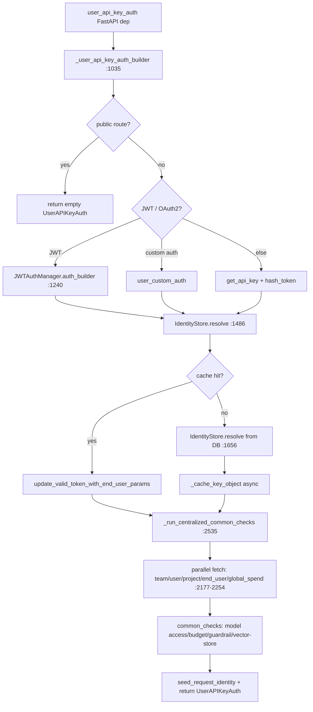
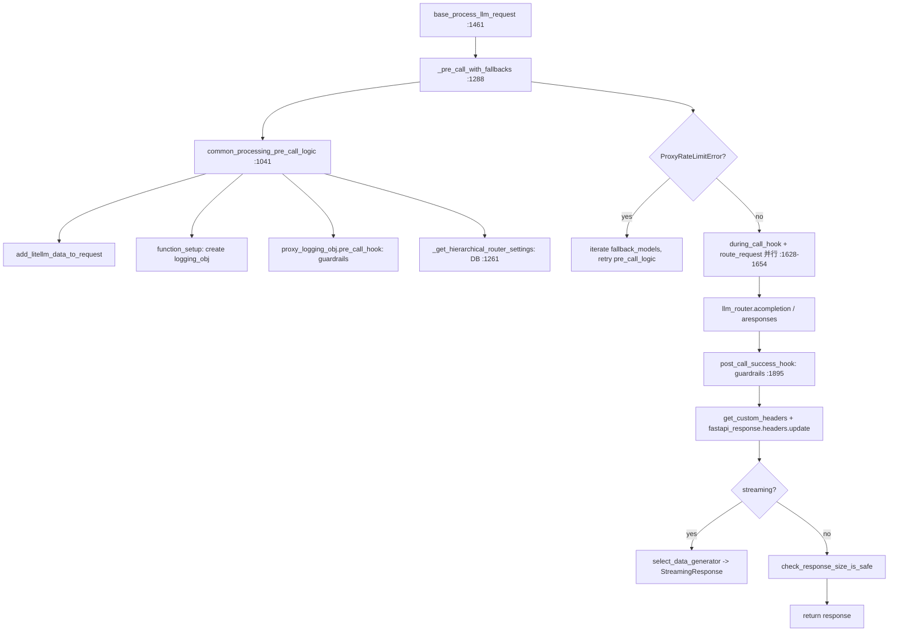
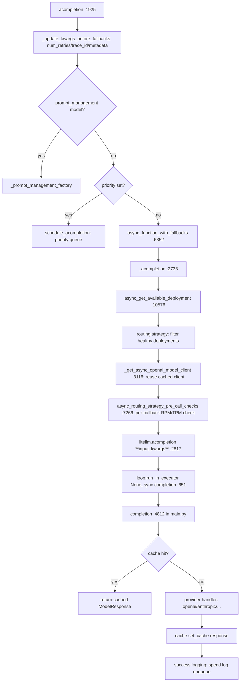

# LiteLLM Proxy 调用链详解：Chat Completions 与 Responses

## 范围与证据

本文基于本地 `F:/codespace/litellm` 源码快照：`litellm_internal_staging` 分支，提交
`b3d05bd10b9a044ea08a1f1ce0e165ee5ba1ef35`
。所有行号引用均对此快照有效。本文只描述请求处理调用链，不做性能判断——性能分析见 [LiteLLM Proxy 性能分析](litellm-proxy-performance-bottlenecks.md)。

**2026-08-01 当前模块级复核**：本地 `litellm_internal_staging` 已 fast-forward 至
`23de7a15d9d40006ee596e617475ba101d60c5e9`。`ProxyBaseLLMRequestProcessing.base_process_llm_request()` 现位于
`litellm/proxy/common_request_processing.py`，`route_request()` 位于 `litellm/proxy/route_llm_request.py`，Responses
endpoint 仍将相应 resource route type 交给共享处理路径。上述固定快照的调用链结论仍是历史证据，详细行号不得当作当前定位。

## 0. 核心结论

Chat Completions 与 Responses 两个对外 endpoint **共享同一请求处理器**
`ProxyBaseLLMRequestProcessing.base_process_llm_request()`，差异仅在三处：

1. FastAPI route 声明的 `route_type`（`acompletion` vs `aresponses`）；
2. `route_request()` 据 `route_type` 分发到 `llm_router.acompletion()` 或 `llm_router.aresponses()`；
3. Responses endpoint 额外支持 background + polling 模式与 managed objects 注册。

因此，两个 endpoint 的非 background 请求在共享处理路径上均经历认证 → pre-call → route → provider call → post-call →
logging/DB。真正的协议转换发生在 `litellm.acompletion()` / `litellm.responses()` 内部及更下游的 provider handler，而不是在
proxy 层。

## 1. 入口与认证阶段（两模式共享）

### 1.1 HTTP 入口

| 模式      | route                                                                 | handler             | route_type    | 证据                                                           |
|-----------|-----------------------------------------------------------------------|---------------------|---------------|----------------------------------------------------------------|
| Chat      | `POST /v1/chat/completions`（及 `/chat/completions`、Azure 兼容路径） | `chat_completion()` | `acompletion` | `litellm/proxy/proxy_server.py:8773`、`:8849`                  |
| Responses | `POST /v1/responses`（及 `/responses`、`/openai/v1/responses`）       | `responses_api()`   | `aresponses`  | `litellm/proxy/response_api_endpoints/endpoints.py:26`、`:200` |

两个 handler 都声明 `dependencies=[Depends(user_api_key_auth)]`，认证在 FastAPI 依赖注入阶段完成，先于 handler body。

### 1.2 认证：`user_api_key_auth()`

位置：`litellm/proxy/auth/user_api_key_auth.py:2486`。认证是请求路径上 DB/缓存访问最密集的阶段。

关键 DB/cache 访问点（per-request）：

- **Key 对象解析**：先查 `UserApiKeyCache`（DualCache：in-memory + Redis），miss 则查 `LiteLLM_VerificationTokenTable`。证据：
  `:1486`、`:1656`。
- **End-user 解析与校验**：`resolve_and_validate_end_user_id()` + `get_end_user_object()`，各走 cache→DB。证据：`:1426`、
  `:1439`。
- **Team 对象刷新检查**：若 token 有 `team_id`，额外查 team cache 以应用 `/team/update` 的最新值。证据：`:1548`。
- **集中检查阶段**（`:2089` `_run_centralized_common_checks`）并行 gather 5 个
  fetch：team、user、project、end_user、global_proxy_spend。每个 fetch 内部仍是 cache→DB。证据：`:2177-2254`。
- **Master key 缓存**：master key 命中时 `asyncio.create_task(_cache_key_object(...))` 异步写缓存，不阻塞响应。证据：
  `:1600`。

认证返回的 `UserAPIKeyAuth` 携带 `user_id`、`team_id`、`org_id`、`project_id`、`end_user_id`、各级 budget/rpm/tpm 限制、
`parent_otel_span` 与 `principal`。

### 1.3 Handler body：元数据填充

Chat handler（`proxy_server.py:8810`）把 `user_api_key_dict` 的 `user_id`/`team_id`/`org_id`/`agent_id` 写入
`data["metadata"]`。Responses handler（`endpoints.py:93`）只读 body，元数据填充推迟到 `base_process_llm_request` 内部。

## 2. 统一处理器：`base_process_llm_request()`

位置：`litellm/proxy/common_request_processing.py:1461`。Chat 与 Responses（非 background 路径）都调用它。Responses 的
background + polling 路径在 `endpoints.py:110-191` 单独处理，但内部仍调用 `common_processing_pre_call_logic` +
`background_streaming_task`。

### 2.1 主干流程

### 2.2 pre-call 阶段：`common_processing_pre_call_logic()`（`:1041`）

此函数做 6 件事，每件都涉及状态访问：

1. `add_litellm_data_to_request()`（`litellm_pre_call_utils.py:1295`）：合并 `metadata`、`proxy_server_request`、
   `arrival_time`、model alias 映射、`litellm_call_id`。无 DB，但有多次 dict 遍历与 `model_alias_map` 查找。
2. Responses 专用：`_authorize_response_file_search_vector_stores()` 校验 file search vector store 权限（`:1161`）。
3. 计算 `queue_time_seconds` 并写入 metadata。
4. 解析最终 `model`：`general_settings.completion_model` → CLI `user_model` → path `model` → body `model`。应用
   `litellm.model_alias_map` 与 `user_api_key_dict.aliases`。
5. `function_setup()` 创建 `LiteLLMLoggingObj`，绑定 `route_type`、`start_time`、`rules_obj`。这是后续 spend
   log、callback、cache handler 的载体。
6. `proxy_logging_obj.pre_call_hook()`：遍历 `litellm.callbacks` 中所有 `CustomLogger`，运行 `async_pre_call_hook`。这是
   guardrail、prompt management、tag filter 的执行点。
7. `_get_hierarchical_router_settings()`（`:1261`）：若 `proxy_config` 存在，查 key/team 级 router_settings（cache→DB），结果作为
   `router_settings_override` 注入 data，避免重建 Router。

### 2.3 路由分发：`route_request()`（`route_llm_request.py:250`）

- `add_shared_session_to_data()` 注入共享 httpx session（若启用）。
- Strip `mock_testing_*` flags（安全修复 VERIA-44）。
- 按优先级匹配：`api_key`/`api_base` 直传 → 批量逗号模型 → `user_config` → `router_settings_override` → router
  model_names/team model/alias/wildcard/default_deployment。
- 最终调用 `getattr(llm_router, route_type)(**data)`，即 `llm_router.acompletion` 或 `llm_router.aresponses`。

### 2.4 provider 调用与并发控制

`base_process_llm_request` 用 `asyncio.gather` 并行运行 `during_call_hook`（moderation/guardrail）与实际 LLM call（
`:1628-1654`）。`cancel_on_disconnect` 可让请求在客户端断开时取消。

## 3. Chat Completions 调用链（router 之后）

### 3.1 `Router.acompletion()`（`router.py:1925`）

### 3.2 `litellm.acompletion()`（`main.py:406`）的关键细节

- `AnthropicCacheControlHook.maybe_seed_default_injection_points()`：为 Anthropic provider 注入 cache_control 标记。
- 若 logging_obj 启用 prompt management，运行 `async_get_chat_completion_prompt` 替换 model/messages。
- **`init_response = await loop.run_in_executor(None, func_with_context)`**（`:651`）：把同步 `completion()` 提交到默认线程池。这是
  async proxy 调用 sync 代码的桥。
- `maybe_run_chat_completion_agentic_loop()`：code-interceptor 等 agentic 循环的分发点（`:679`）。

### 3.3 同步 `completion()`（`main.py:4812`）内的缓存

- `preset_cache_key = kwargs.get("preset_cache_key")`。
- `LLMCachingHandler`（`caching_handler.py:127`）在 logging_obj 初始化时创建，持有 `DualCache`（Redis + in-memory）。
- 缓存查找在 `LLMCachingHandler._sync_get_cache()` / `_async_get_cache()`（`:289` / `:150`）：
    - 构造 cache key：`litellm.cache.get_cache_key(**kwargs)`（`caching.py:329`），遍历所有 `kwargs` 中属于 LLM API 参数的键，拼接后
      hash。
    - `litellm.cache.get_cache()`（`caching.py:571`）→ `DualCache.get_cache()`（`dual_cache.py:153`）→ in-memory 先查，miss 则
      `RedisCache.get_cache()`（`redis_cache.py:974`，同步 `redis_client.get`）。
    - 命中则 `_convert_cached_result_to_model_response` 返回，跳过 provider 调用。
- 未命中则调用 provider handler，返回后 `async_set_cache` / `sync_set_cache`（`caching_handler.py:941` / `:1008`）写回。流式响应在
  `streaming_handler.py:1642-1650` 逐 chunk 累积写缓存。

## 4. Responses 调用链（router 之后）

### 4.1 `Router.aresponses()` 与 `litellm.aresponses()`

Router 内部 `aresponses` 走 `_aresponses_with_streaming_fallbacks`（`router.py:4538`），结构与 acompletion 对称：get
deployment → get client → pre_call_checks → `litellm.aresponses()`。

`litellm.aresponses()`（`responses/main.py:404`）与 `acompletion` 结构几乎相同：

- prompt management hook（`:473-501`）。
- **`init_response = await loop.run_in_executor(None, func_with_context)`**（`:537`）：同样把同步 `responses()` 提交到线程池。
- 同步 `responses()`（`:869`）内部解析 provider 的 Responses config：
    - 若有 native Responses config（如 OpenAI 原生），走 provider Responses transform。
    - 否则进入 `LiteLLMCompletionTransformationHandler.response_api_handler()`（`responses/main.py:1058`，handler 定义于
      `responses/litellm_completion_transformation/handler.py:23`），把 Responses 请求转为 Chat completion 请求，调
      `litellm.completion(..., _skip_responses_api_bridge=True)`，再把 Chat 响应转回 Responses。re-entry guard 在
      `handler.py:62`、`:107`。

### 4.2 Responses 特有路径

- **Background + polling**（`endpoints.py:95-191`）：若 `should_use_polling_for_request` 为 true，先跑
  `common_processing_pre_call_logic`（同步返回 429/403 给客户端），生成 `polling_id`，
  `asyncio.create_task(background_streaming_task)` 在后台流式完成并更新 Redis cache。客户端用
  `GET /v1/responses/{polling_id}` 轮询。
- **Managed objects 注册**：非流式 Responses 返回后，若 `data["background"]` 且 response status 为 queued/in_progress，写
  `LiteLLM_ManagedObjectTable`（`:216`）。
- **Container ownership**：流式 Responses 用 `_wrap_responses_stream_for_container_ownership`（
  `common_request_processing.py:2038`）在 stream 结束时注册 code-interpreter container，否则后续
  `/v1/containers/{id}/files` 会 403。
- **Responses resource API**：`aget_responses`、`adelete_responses`、`acancel_responses`、`acompact_responses`、
  `alist_input_items` 各有 route_type，都经 `base_process_llm_request` → `route_request` → `llm_router.a<op>` →
  `litellm.a<op>`。

## 5. 日志与 spend 写入（两模式共享）

### 5.1 success/failure handler 链

`base_process_llm_request` 在响应成功后调用 `proxy_logging_obj.post_call_success_hook()`（`:1895`），流式在 stream 结束时触发。
`ProxyLogging` 遍历 `litellm.callbacks`（`CustomLogger` 列表）的 `async_success_hook` / `success_handler`。

### 5.2 spend log 入队

- 每个 `LiteLLMLoggingObj` 在 success handler 中构造 `StandardLoggingPayload`。
- spend log 行 append 到 `prisma_client.spend_log_transactions` 列表（内存队列，`utils.py:2777`），受
  `_spend_log_transactions_lock` 保护。
- **不在请求路径同步写 DB**。

### 5.3 批量 flush

- `update_spend_logs()`（`utils.py:5171`）由定时 job（`update_spend`，每分钟，`:5267`）与队列监控任务（
  `_monitor_spend_logs_queue`，`:5426`）触发。
- 每次 flush 最多 `MAX_LOGS_PER_INTERVAL=10000` 行，分批 `BATCH_SIZE=1000` 写入。
- 写入用 `_create_spend_logs_with_poison_isolation`（`:5216`）做 poison-row 隔离，避免单条坏数据使整批失败。
- 可选 `SPEND_LOGS_URL` 把队列转发到独立 DB writer 服务（`:5198-5207`）。

### 5.4 user/team/key spend 累加

`ProxyUpdateSpend.update_spend()`（`:5130`）用 `prisma_client.db.tx(timeout=60s)` 事务 + `batch_()` 批量更新
`LiteLLM_UserTable`/`LiteLLM_TeamTable`/`LiteLLM_TableKey` 的 spend 字段。同样在定时 job 中，非 per-request。

## 6. 客户端连接复用

`Router._get_client()`（`router.py:9965`）按 `model_id` + `client_type`（async/sync/stream/max_parallel_requests）从
`self.cache`（DualCache，`local_only=True`）取缓存的 `AsyncOpenAI` / `AsyncAzureOpenAI` client。这些 client 内部持 httpx
连接池，跨请求复用。仅当 `api_key` 动态变化时才放弃复用（`:3128-3134`）。

## 7. 两模式调用链对照表

| 阶段            | Chat Completions                                                         | Responses                                                                                   |
|-----------------|--------------------------------------------------------------------------|---------------------------------------------------------------------------------------------|
| HTTP 入口       | `chat_completion()` `proxy_server.py:8849`                               | `responses_api()` `endpoints.py:200`                                                        |
| 认证            | `user_api_key_auth`（共享）                                              | 同左                                                                                        |
| 处理器          | `base_process_llm_request(route_type="acompletion")`                     | 同左，`route_type="aresponses"`；background 路径单独                                        |
| pre-call        | `common_processing_pre_call_logic`（共享）                               | 同左 + file search vector store 授权                                                        |
| router settings | `_get_hierarchical_router_settings`（共享）                              | 同左                                                                                        |
| route_request   | → `llm_router.acompletion`                                               | → `llm_router.aresponses`                                                                   |
| router 内部     | `_acompletion` → `litellm.acompletion`                                   | `_aresponses_with_streaming_fallbacks` → `litellm.aresponses`                               |
| SDK 入口        | `litellm.acompletion` `main.py:406` → `run_in_executor(sync completion)` | `litellm.aresponses` `responses/main.py:404` → `run_in_executor(sync responses)`            |
| 协议桥          | 无（原生 Chat）                                                          | native Responses 或 `LiteLLMCompletionTransformationHandler` Chat-bridge（`handler.py:23`） |
| 缓存            | `LLMCachingHandler` + `DualCache`（共享）                                | 同左                                                                                        |
| post-call       | `post_call_success_hook`（共享）                                         | 同左 + container ownership wrap                                                             |
| 响应            | ModelResponse / CustomStreamWrapper                                      | ResponsesAPIResponse / BaseResponsesAPIStreamingIterator                                    |
| spend           | `spend_log_transactions` 入队 + 定时 flush（共享）                       | 同左                                                                                        |

## 8. 关键文件索引

| 文件                                                             | 角色                                                             |
|------------------------------------------------------------------|------------------------------------------------------------------|
| `litellm/proxy/proxy_server.py`                                  | FastAPI app、Chat endpoint、全局对象                             |
| `litellm/proxy/response_api_endpoints/endpoints.py`              | Responses endpoint、background/polling                           |
| `litellm/proxy/common_request_processing.py`                     | `ProxyBaseLLMRequestProcessing`：统一处理器                      |
| `litellm/proxy/route_llm_request.py`                             | `route_request`：route_type 分发                                 |
| `litellm/proxy/auth/user_api_key_auth.py`                        | 认证、key/team/user 解析、集中检查                               |
| `litellm/proxy/litellm_pre_call_utils.py`                        | `add_litellm_data_to_request`                                    |
| `litellm/router.py`                                              | Router：deployment 选择、client 复用、fallback、pre_call_checks  |
| `litellm/main.py`                                                | `acompletion`/`completion`：SDK 入口、cache、provider dispatch   |
| `litellm/responses/main.py`                                      | `aresponses`/`responses`：Responses SDK 入口、native/bridge 选择 |
| `litellm/responses/litellm_completion_transformation/handler.py` | Responses→Chat bridge handler                                    |
| `litellm/caching/caching.py`                                     | `Cache` 类：get_cache_key、get_cache、add_cache                  |
| `litellm/caching/caching_handler.py`                             | `LLMCachingHandler`：cache 查找/写入/转换                        |
| `litellm/caching/dual_cache.py`                                  | `DualCache`：in-memory + Redis 两级                              |
| `litellm/caching/redis_cache.py`                                 | `RedisCache`：同步 + async Redis 客户端                          |
| `litellm/caching/in_memory_cache.py`                             | `InMemoryCache`：进程内 LRU/dict                                 |
| `litellm/proxy/utils.py`                                         | `PrismaClient`、`ProxyUpdateSpend`、spend log 队列与 flush       |
| `litellm/proxy/common_utils/user_api_key_cache.py`               | `UserApiKeyCache`（DualCache 子类）                              |
| `litellm/litellm_core_utils/litellm_logging.py`                  | `LiteLLMLoggingObj`：callback/spend 载体                         |
