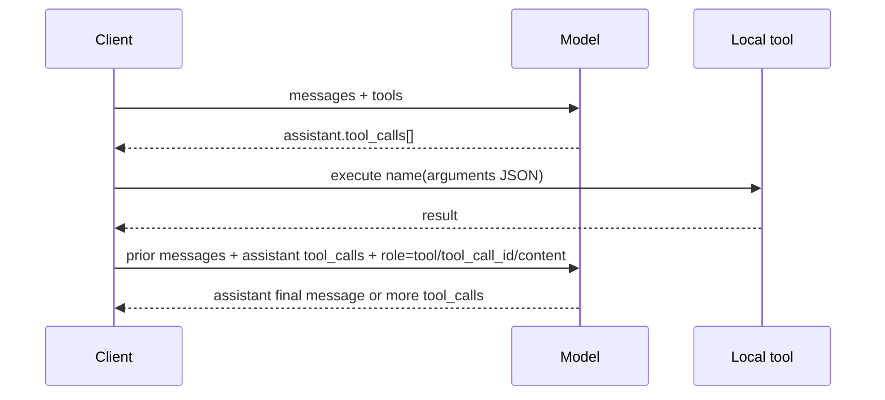

# OpenAI Chat Completions 协议规范学习笔记

## 1. 定位与权威来源

`POST /v1/chat/completions` 是以有序 `messages[]` 表示上下文、以 `choices[]` 表示模型候选输出的生成 API。它仍受支持，但当前官方 Reference 对新项目提示优先考察 Responses API；不能据此把 Chat 当作已失效协议。

- API Reference：https://developers.openai.com/api/reference/resources/chat/subresources/completions/methods/create
- Streaming guide：https://platform.openai.com/docs/guides/streaming-responses
- Function calling：https://platform.openai.com/docs/guides/function-calling
- Structured Outputs：https://platform.openai.com/docs/guides/structured-outputs
- OpenAPI path：`/chat/completions`（`GET` list、`POST` create）；`/chat/completions/{completion_id}` 与 `/messages` 是已存储 completion 的资源面。

本文是 2026-08-03 复核的协议快照。准确可支持字段必须再按目标 model 核对。

## 2. 主请求契约

最小 request 是 model 和一段 user message：

```http
POST /v1/chat/completions
Content-Type: application/json
Authorization: Bearer $OPENAI_API_KEY

{
  "model": "gpt-5.6",
  "messages": [
    {"role": "user", "content": "Explain this API."}
  ]
}
```

核心字段：

| 字段 | 语义 | 转换器必须保留的性质 |
|---|---|---|
| `model` | 使用的模型标识 | 原样传递或由显式 deployment mapping 替换；不能从 endpoint 名称猜模型能力 |
| `messages[]` | 到当前请求为止的有序对话 transcript；content part 可包含 text、image、audio 与 file | **顺序**、role、content part、tool correlation 都是语义，不可按 role 分组，也不能把非文本 part 静默删除 |
| `tools[]` | 可调用的 function/custom tool 定义 | tool type、schema/name/strict 或 custom format 与 tool choice 共同决定行为 |
| `tool_choice` | 禁止、自动、要求或指定工具 | 不是可忽略的展示参数 |
| `parallel_tool_calls` | 是否允许并行 tool calls | 会影响输出的 call 数量和执行策略 |
| `response_format` | text/JSON mode/JSON Schema structured output | Chat 的结构化输出位置；不能直接命名为 Responses `text.format` |
| `stream` / `stream_options` | 启用 SSE 和附加流信息 | stream 的类型、终态和 usage 分发都改变 |
| `max_completion_tokens` | 最大生成 token 上限（含 reasoning model 的可见和 reasoning token） | 不要与 Responses `max_output_tokens` 机械视为同一字段 |
| `temperature`, `top_p`, `seed`, `logprobs`, `top_logprobs`, `n`, `stop` | 生成控制/采样 | 支持度依 model 而异，转换时应走 capability gate |
| `modalities`, `audio` | 多模态输出控制 | 仅支持模型可用，不能在 text-only target 静默删除 |
| `prediction` | 已知输出内容的 predicted output 配置 | 只在目标 model 明确支持时使用，不能当作普通 prompt 文本 |
| `reasoning_effort` | Chat reasoning effort 配置 | 与 Responses 的 `reasoning.effort` 是不同 wire 位置，只能经显式 Bridge 规则转换 |
| `web_search_options` | Chat 内建 web search 配置 | 工具执行责任和 citations 不能降级成 client function tool |
| prompt cache、moderation、`metadata`、`store`、`service_tier`、`user` 等字段 | 缓存、安全、存储、运营与追踪控制 | 需按目标模型、Provider 和数据治理契约独立 gate，不能因字段存在就宣称支持 |

Reference 明确说明：参数支持会随 model 变化，尤其是 reasoning model。因此 request validator 应分成“通用 JSON shape”与“model capability policy”两层。

## 3. `messages[]` 的语义模型

### 3.1 role 与优先级

Chat request 的上下文是 role-tagged messages 的序列：

| role | 用途 | 关键约束 |
|---|---|---|
| `developer` | 开发者指令 | 对较新的 o1 及后续模型，官方说明其替代旧的 `system` 指令位置 |
| `system` | 系统指令 | 仍是协议 role；不得在转换中凭空删除或把它当 user text |
| `user` | 终端用户输入/上下文 | 可为 text 或模型支持的 image/audio/file parts |
| `assistant` | 之前的模型输出 | content 可为 text/refusal；也可携带 `tool_calls`，此时 content 可缺席 |
| `tool` | 本地工具执行结果 | 必须以 `tool_call_id` 对应先前 assistant tool call |
| `function` | 旧 function calling 形状 | 属于历史兼容面；新实现应以 `tool` + `tool_call_id` 为主 |

序列的意义在于模型看到的是“谁在何时说了什么”。合并 messages、改写 role 或把 tool result 提前插入会改变调用语义。

### 3.2 content parts

- `developer` / `system` 支持 text。
- `user` 可为 string 或 typed part array；官方 Reference 列出 `text`、`image_url`、`input_audio`、`file`，但实际可用种类由模型决定。
- `assistant` 可为 text 或 refusal part，且可携带 audio reference、旧 `function_call`、新的 `tool_calls[]`。
- image URL 可为普通 URL 或 data URL/base64；input audio 使用 base64 数据与 format。

因此 canonical model 不能把 `content` 固定成 string；至少需要“message + ordered parts”的表示。

## 4. Function tool 调用闭环

Chat 的 function call 是从 assistant message 到 tool message 的成对关系：



典型非流式输出：

```json
{
  "choices": [{
    "index": 0,
    "finish_reason": "tool_calls",
    "message": {
      "role": "assistant",
      "content": null,
      "tool_calls": [{
        "id": "call_abc",
        "type": "function",
        "function": {"name": "get_weather", "arguments": "{\"city\":\"Paris\"}"}
      }]
    }
  }]
}
```

下一轮必须发送与 `id` 相同的关联键：

```json
{
  "role": "tool",
  "tool_call_id": "call_abc",
  "content": "{\"temperature_c\":25}"
}
```

官方指南特别提醒：`arguments` 是模型生成的 JSON string，可能不是合法 JSON，也可能不符合 schema；应用必须 parse、validate、授权，再执行工具。不能将模型 arguments 当可信命令。

**转换器不变量**：`tool_call.id` 是 call correlation key；不是 message id、choice index 或 stream chunk index。多个 tool calls 可能并行出现，不能只保存第一个。

## 5. 非流式响应契约

成功响应的主对象为 `object: "chat.completion"`：

```json
{
  "id": "chatcmpl_...",
  "object": "chat.completion",
  "created": 0,
  "model": "gpt-5.6",
  "choices": [
    {
      "index": 0,
      "message": {"role": "assistant", "content": "..."},
      "finish_reason": "stop",
      "logprobs": null
    }
  ],
  "usage": {
    "prompt_tokens": 0,
    "completion_tokens": 0,
    "total_tokens": 0
  }
}
```

需要特别处理：

- `choices[]` 的数量由 `n` 等请求语义决定；协议层不能天然假设只有一个 choice。
- 常见 `finish_reason` 有 `stop`、`length`、`tool_calls`、`content_filter`；旧 `function_call` 是兼容值。应保留未知未来枚举，而不是因未知值崩溃。
- `message.content` 不一定有文本：可能是 tool call、refusal、音频或 model-specific 输出。
- `usage` 有 prompt/completion/total 及详情字段；不要与 Responses 的 `input_tokens` / `output_tokens` 名称混淆。

## 6. 流式协议

`stream=true` 使服务器以 **data-only SSE** 返回 `chat.completion.chunk`。每个 chunk 的核心为：

```json
{
  "object": "chat.completion.chunk",
  "choices": [{
    "index": 0,
    "delta": {"content": "partial"},
    "finish_reason": null
  }]
}
```

与非流式不同，chunk 用 `choices[].delta` 而非 `choices[].message`。`delta` 可以包含 role、文本片段、tool-call 的 name/arguments 片段，或为空；客户端必须按 choice/tool-call index 累积。

实践状态机：

1. 为每一个 `choice.index` 建立 accumulator；对 tool call 再按其 index/id 建立 argument buffer。
2. 每个 `delta.content` append 到相应 assistant content。
3. 每个 tool-call arguments delta append，不要逐片 parse JSON。
4. 接收到该 choice 非空 `finish_reason` 后标记该 choice 的生成结束；只在所有需要的 choice 完整且 stream 正常收尾后输出最终对象。
5. 若请求了流式 usage，按 `stream_options` 的官方语义处理尾部 usage chunk；不能假定每个 chunk 都有 usage。

官方 streaming guide 对比指出：Chat stream 是 data-only SSE chunks，而 Responses 是 typed semantic events。故将两者转换时需要真正的 stream assembler，不是只改 event 名称。

## 7. Structured output

Chat 的 response-level structured output 位于：

```json
{
  "response_format": {
    "type": "json_schema",
    "json_schema": {
      "name": "answer",
      "strict": true,
      "schema": {"type": "object"}
    }
  }
}
```

`json_object` 仅保证 valid JSON，JSON Schema Structured Outputs 才承诺 schema adherence（模型支持时）。对方言 converter：

- Chat 的字段名/位置为 `response_format`。
- Responses 的字段名/位置为 `text.format`。
- 两者共享“structured output”意图，但 JSON schema wrapper 并非字节级等价，应显式 transform 并做 schema compatibility test。

官方 guide：https://platform.openai.com/docs/guides/structured-outputs

## 8. 对协议转换器的设计结论

- 内部模型要表达 `Message(role, parts, tool_calls, tool_result_ref)`，不能只有 `role + text`。
- 保留 `choices[]` 和 `index`，哪怕产品层最终只展示 choice 0。
- 保存完整 assistant tool-call message，再追加 tool result；否则下一轮上下文不完整。
- 对 stream 分别追踪 content、refusal、tool calls、arguments、finish reason、usage。
- `function_call` / `functions` 是 deprecated compatibility 面；不要在新 canonical IR 中将它设计成主形状。
- `store`、metadata、service tier、user、prompt cache 等不是纯生成字段；只有在明确目标等价时才转发。
- audio/file content、custom tool、predicted output、web search 和 moderation 都需要协议专有 capability；仅在定义层预留名称不等于请求路径已实现。
