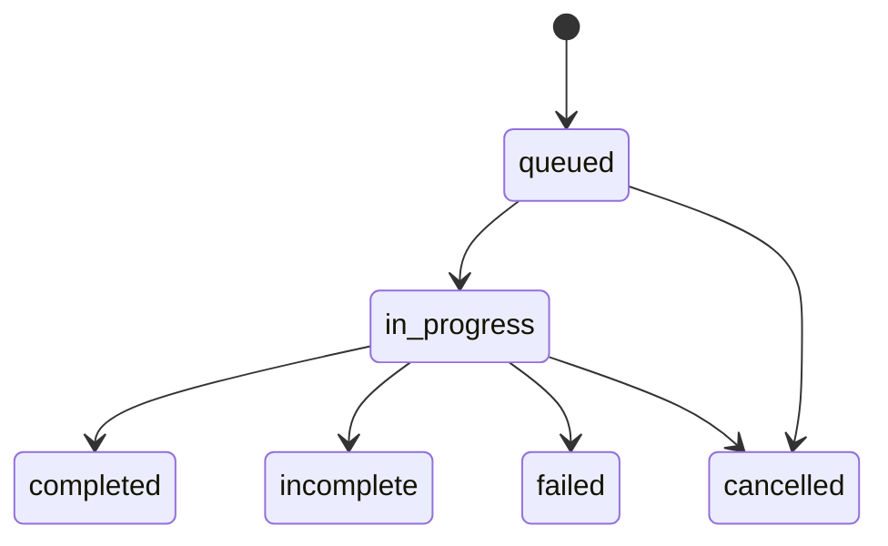
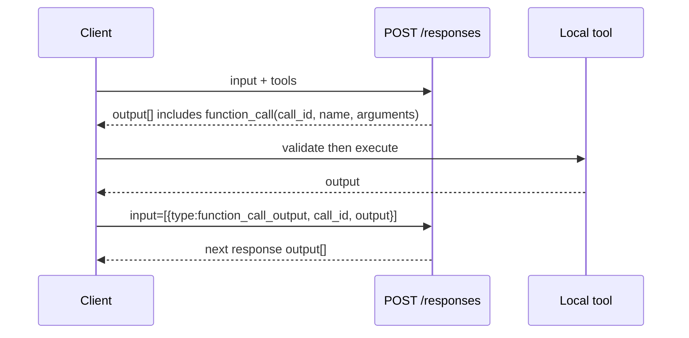

# OpenAI Responses API 协议规范学习笔记

## 1. 定位与权威来源

`POST /v1/responses` 是 OpenAI 当前面向 text、multimodal、tools、agent state 与 streaming 的主生成 API。它不是“Chat Completions 的换字段版本”：输入/输出是异构 item 列表，服务端有 response lifecycle、conversation、background、compaction 和 typed SSE event。

- API Reference：https://developers.openai.com/api/reference/resources/responses/methods/create
- Reasoning guide：https://developers.openai.com/api/docs/guides/reasoning
- Migration guide：https://platform.openai.com/docs/guides/migrate-to-responses
- Streaming guide：https://platform.openai.com/docs/guides/streaming-responses
- Conversation state：https://platform.openai.com/docs/guides/conversation-state
- Function calling：https://platform.openai.com/docs/guides/function-calling
- Background mode：https://platform.openai.com/docs/guides/background
- OpenAPI paths：`/responses`, `/responses/{response_id}`, `/responses/{response_id}/input_items`, `/responses/{response_id}/cancel`, `/responses/compact`, `/responses/input_tokens`。

本文以 2026-08-03 复核的官方规范为准；model-specific 和 beta 特性必须单独 capability gate。第 6.1～6.3 节另以本地 Codex 固定证据快照 `main` @ `4c43465133428898aa84f0bfc02c306ed65fb66a` 的实际 parser 作补充核对：它用于识别**客户端依赖的扩展**，不把这些扩展误写成公开 Responses 契约。2026-08-01 已在当前 `main` @ `ee0247f95a6fe2b094ba2253d82cae2a2b4c2dff` 复核相关 event parser 仍存在；细粒度行号仍以固定快照为准。

## 2. 主请求契约

最小文本 request：

```http
POST /v1/responses
Content-Type: application/json
Authorization: Bearer $OPENAI_API_KEY

{
  "model": "gpt-5.6",
  "input": "Explain the Responses API."
}
```

字符串 `input` 等价于 user text input。复杂请求使用有序异构 `input[]`：

```json
{
  "model": "gpt-5.6",
  "instructions": "Answer concisely.",
  "input": [
    {
      "type": "message",
      "role": "user",
      "content": [
        {"type": "input_text", "text": "What is shown?"},
        {"type": "input_image", "image_url": "https://example.invalid/image.png", "detail": "auto"}
      ]
    }
  ]
}
```

### 2.1 关键请求字段

| 字段 | 作用 | 协议含义 |
|---|---|---|
| `model` | 目标模型 | capability 的主键；不应由 converter 假设所有字段都支持 |
| `input` | string 或异构 item list | 以有序 item log 表达当前输入、历史输出、tool call/result 等 |
| `instructions` | 顶层指令 | 独立于 `input[]` 的 instruction channel；和 Chat `system/developer` 不能简单一对一折叠 |
| `conversation` | conversation id/object | 该 conversation 的 items 被 prepend；response 完成后 input/output items 自动加入 conversation |
| `previous_response_id` | 前一 response 的链式 continuation | 复用服务端 response chain，不代表历史 input token 不计费 |
| `tools`, `tool_choice`, `parallel_tool_calls`, `max_tool_calls` | 自定义与内置工具控制 | Responses tool 类型和 output item 比 Chat 更广 |
| `text.format` | text / JSON mode / JSON Schema output | Responses 的 structured output 位置，区别于 Chat `response_format` |
| `reasoning` | Responses 顶层 reasoning 配置对象 | 需与 `reasoning.effort`、encrypted reasoning replay 及 model capability 一起处理 |
| `reasoning_effort` | 当前 Responses Create 参考未列出的顶层字段 | Responses Bridge/Native 均拒绝；它只属于 Chat 或 Provider 私有兼容面的字段 |
| `include` | 请求附加输出数据 | 例如 file search results、web sources、message logprobs、`reasoning.encrypted_content` |
| `store` | 服务端保存行为 | 与 resource retrieval、background 和 ZDR/stateless 设计相关 |
| `background`, `stream` | 异步资源生命周期与 SSE | 二者组合会改变 retrieve/cancel/reconnect 需求 |
| `truncation`, `context_management`, `max_output_tokens` | context 与输出边界 | 不要用 Chat 字段名直接代换 |
| `metadata`, `prompt`, cache/service tier/safety identifier 等 | 运营、prompt、缓存与服务控制 | 只有目标 provider 有对应契约时才可转发 |

### 2.2 `input[]` 不是 messages 的同义词

输入可包含 role message，但 Reference 定义了更多 item 形状，包括先前 assistant output message、reasoning、function/custom tool call、function/custom tool call output，以及若干 built-in tool 相关 item。对 converter 的直接后果：

- 不能只读取 `input[].role`；必须按 `type` 解析。
- 不能把所有 item 都渲染为文本；function result 和 reasoning 都是下一轮正确性所需状态。
- must-preserve 的是 item **顺序、type、id/call_id、内容与状态**，不是仅最终 `output_text`。

输入 message 的 role 可为 `user`、`assistant`、`system`、`developer`；Reference 还定义 assistant `phase`（`commentary` / `final_answer`）供某些 Codex 类模型的 follow-up replay 使用。

### 2.3 `reasoning` 与 `reasoning_effort` 的标准边界（2026-08-03 复核）

本次直接复核 OpenAI 的 [Responses Create API Reference](https://developers.openai.com/api/reference/resources/responses/methods/create) 与 [Reasoning models guide](https://developers.openai.com/api/docs/guides/reasoning)，结论如下：

- **Responses 包含 `reasoning`**：它是请求顶层的 reasoning 配置对象；官方 Responses 示例使用 `reasoning: {"effort": "low"}`，其中 `reasoning.effort` 控制 reasoning effort。支持值和默认值由具体 model 决定，不能由 converter 固定假设。
- **Responses 不包含标准顶层 `reasoning_effort`**：当前 Responses Create 参考与官方 reasoning 示例均以 `reasoning.effort` 为字段路径，没有将 `reasoning_effort` 定义为 Responses 请求的标准顶层字段。该名称可以存在于 Chat 请求或 Provider 私有协议中，但不能反向写成 Responses 标准；当前 OpenBridge 对 Responses 直接拒绝该字段。
- **`reasoning` 还可能是 output item 类型**：Responses 的 `output[]` 可以包含 `type: "reasoning"`；无状态或 ZDR 场景下，`encrypted_content` 用于后续 turn 的 reasoning continuity。这里的 output item 与请求顶层 `reasoning` 配置不是同一个 JSON 位置，但二者共同构成 Responses 的 reasoning 契约。

因此，Responses 标准字段应使用 `reasoning.effort`，Chat 标准字段应使用 `reasoning_effort`；二者不互相作为入站别名。当前 Bridge 还要求选定 Upstream API 的 `ReasoningOutput` 与方向匹配：Chat 上游必须是 `PlainText`，Responses 上游可为 `PlainText` 或 `Summary`。满足 capability gate 时，Responses 的 `reasoning` 配置映射为 Chat 的 `reasoning_effort`，Chat 的 `reasoning_content` 映射为 Responses `reasoning` output/input item 与对应 SSE channel；reasoning 不进入 `output_text` 或 Chat `content`。无法转换的 `encrypted_content` continuation 仍在 egress/stream state 边界 fail closed，不伪造为明文。

## 3. 输出对象与生命周期

非流式成功结果为 `object: "response"`。主要字段包括：

```json
{
  "id": "resp_...",
  "object": "response",
  "created_at": 0,
  "model": "gpt-5.6",
  "status": "completed",
  "output": [
    {
      "type": "message",
      "id": "msg_...",
      "role": "assistant",
      "status": "completed",
      "content": [{"type": "output_text", "text": "...", "annotations": []}]
    }
  ],
  "output_text": "...",
  "usage": {"input_tokens": 0, "output_tokens": 0, "total_tokens": 0}
}
```

### 3.1 `output[]` 是权威的结构化输出

`output_text` 是从输出 message text 方便读取的聚合属性；它不替代 `output[]`。`output[]` 可以依次出现：

- `message`：assistant message，content part 可能为 `output_text`、refusal、citation/annotation 等；
- `reasoning`：summary 与可选 encrypted continuation content；
- `function_call` / `custom_tool_call`：由客户端执行的工具调用；
- built-in tool items：例如 web search、file search、computer/code interpreter 等调用与结果。

`function_call_output` / `custom_tool_call_output` 则是客户端执行完调用后，在**下一次 request 的 `input[]`** 中发送的对应结果；它不是可用 `output_text` 替代的历史文本。

因此客户端必须把“最终可展示 text”与“完整可 replay item log”拆开存储。

### 3.2 response status

Responses 的状态空间比 Chat `finish_reason` 丰富。常见 lifecycle：



实际 response 还可能携带 `error`、`incomplete_details`、usage、completed timestamp。实现应把未知将来状态保留为 opaque string，并明确按以下责任处理：

- `completed`：可读取完整 output，但仍需检查其中是否有需要应用执行的 function call；
- `incomplete`：检查 `incomplete_details.reason`，例如 `max_output_tokens` / content filter 类原因，不能把部分 `output_text` 当最终正确答案；
- `failed` / `cancelled`：读取错误/状态并映射到本地 terminal failure；不要伪造成 `completed`。

官方 Structured Outputs guide 也给出 `status=incomplete` 与 refusal 的单独处理示例。

## 4. Function tool 调用闭环

Responses 使用 `call_id` 关联工具结果，而不是 Chat `tool_call_id` 字段名：



请求工具结果的典型 item：

```json
{
  "type": "function_call_output",
  "call_id": "call_abc",
  "output": "{\"temperature_c\":25}"
}
```

工具调用指南的硬约束：

1. arguments 是不可信的模型输出，必须 JSON parse、schema validate、授权和错误处理。
2. tool result 必须保留对应的 `call_id`。
3. 并行调用可能存在；`call_id` 才是稳定关系键，不能以 `output` array index 关联。
4. 要继续工具循环，不能丢原 prompt、工具定义、model 生成的 call item 或 result item。

Responses 可以含 OpenAI-hosted tools 和 custom client tools。将前者降级为 Chat function tool，或反向把 Chat 函数虚构成 hosted tool，都会改变执行责任与安全边界；必须由 capability profile 显式决定。

## 5. 三种多轮状态策略

### 5.1 `previous_response_id`

提交新 input 并指向前一 `response.id`。适合沿服务端 response chain continuation。官方明确说明：即便使用它，前序 input tokens 仍计入后续请求的 input token 费用。

### 5.2 Conversations API

`conversation` 绑定长期 conversation resource：其 items 会自动进入下一 request 的上下文，response 完成后新的 input/output items 自动写入。官方 conversation guide 指出，conversation objects/items 不受普通 response 的 30-day TTL 约束。

### 5.3 手动 item replay

客户端自行保留输入与 `response.output[]`，在后续 request 的 `input[]` 中回放。它适合无状态/ZDR 或 provider migration，但必须保留 tool/reasoning/message item 的结构。若 reasoning continuation 必需，按 Reference 的 `include: ["reasoning.encrypted_content"]` 获取并按同一兼容边界重放。

**不得误解**：`previous_response_id`、conversation、manual replay 是三种不同 state owner。转换器要选定一个 owner，或在 response metadata 中记录其等价性/降级，而不是把它们混为一个字符串 history。

## 6. Streaming：typed semantic SSE

设置 `stream=true` 后，Responses 使用 SSE。与 Chat chunk 不同，每个 event 有 `type` 和预定义语义。官方 guide 给出的常见 text lifecycle：

```text
response.created
response.in_progress
response.output_item.added
response.content_part.added
response.output_text.delta*
response.output_text.done
response.content_part.done
response.output_item.done
response.completed
```

还存在 function arguments delta/done、reasoning、refusal、file-search、code-interpreter 等 typed event，以及顶层 `error`。正确的 stream assembler：

1. 用 `response.id` 建立 response state，用 `output_index` / item id 建立输出项 state。
2. 收到 `output_item.added` 时创建 item；在各类 delta event 中只更新该 item 的 buffer。
3. 对 `response.function_call_arguments.delta` 累积字符串，直到 done 后再 parse/validate arguments。
4. `response.output_item.done` 表示一个 item 完结，**不等于整个 response 结束**。
5. 将 `response.completed`、`response.incomplete`、`response.failed` 作为 response terminal event，读取其中 response status/usage/error。
6. 收到顶层 `error` 或连接异常时按 transport failure 处理，不把已收到的 partial text伪装为 completed result。

官方建议 Responses 用于 streaming，因为事件是语义化、类型化的；Chat 的通用 delta 不能无损地直接改名为这些 events。

### 6.1 公开 event 覆盖清单（2026-07-25 核对）

不能把第 6 节示例中的 text lifecycle 当成完整 event 枚举。当前官方 [Streaming Events Reference](https://platform.openai.com/docs/api-reference/responses-streaming) 还列出 custom tool、MCP、code interpreter、image generation、annotation 与拒答等事件；下表是实现和 fixture 的最低检查维度，不是 OpenBridge 首版 Bridge 的功能承诺。

| event 类别 | 代表 event | 协议处理不变量 | Native Path | 首版 Bridge |
|---|---|---|---|---|
| response lifecycle | `response.queued`、`response.created`、`response.in_progress`、`response.completed`、`response.incomplete`、`response.failed`、`response.cancelled` | response 终态只能有一个；`output_item.done` 不是终态 | 识别终态但保留原始 SSE | 映射最小 terminal outcome |
| message/content | `response.output_item.*`、`response.content_part.*`、`response.output_text.*`、`response.output_text.annotation.added`、`response.refusal.*` | 以 `output_index`、`item_id`、`content_index` 组装；annotation/refusal 不是普通 text 的可丢弃注释 | 透明保留 | text 仅覆盖已声明子集；其余先拒绝/声明损失 |
| client function tool | `response.function_call_arguments.delta` / `.done` | arguments 只能按字符串累积至完成后校验；关联用 `call_id` | 透明保留 | 首批支持对象 |
| custom tool | `response.custom_tool_call_input.delta` / `.done` | `item_id` 与 `call_id` 均可能出现，不能互相改名 | 透明保留 | 未纳入首批 function-only Bridge；请求声明时预先拒绝 |
| reasoning | `response.reasoning_summary_part.added`、`response.reasoning_summary_text.*`、`response.reasoning_text.*` | summary/content、item id 与 index 不是 user-visible text 的替代物 | 透明保留 | summary 仅按明确 ConversionPlan 近似；opaque reasoning 默认拒绝 |
| MCP 与 hosted tools | `response.mcp_call_arguments.*`、`response.mcp_call.completed/failed`、file search、web search、computer、code interpreter、image generation 相关 event | tool owner、approval、result 和 output item 都必须保留；不能伪装为本地 function | 透明保留 | 默认 unsupported，不能静默降级 |
| stream error | 顶层 `error` | 立即是 stream failure，不与 `response.failed` 或 EOF 混同 | 原样转发并记录终态 | 转换为 source 协议的错误终态 |

官方 event catalog 会随模型和工具能力扩展。新增 event 的默认规则是：**native 同协议流不因网关不认识而重写或丢弃；跨协议 Bridge 不因“看起来像文本”就转换。**

### 6.2 Codex 交叉核对：标准事件与私有扩展分界

本节依据 [Codex Responses SSE 与工具调用生命周期调研](../codex/codex-sse-and-tool-lifecycle-analysis.md) 所记录的源码快照。其 `process_responses_event()` 直接消费 `response.custom_tool_call_input.delta`、reasoning summary/content、item lifecycle 与 response terminal events；这验证了这些 event 对目标客户端的重要性，但**不扩大** OpenBridge 首版 Bridge 的能力边界。

| 输入 | 分类 | Codex 观察 | OpenBridge 规则 |
|---|---|---|---|
| `response.custom_tool_call_input.delta` / `.done` | 官方 Responses event | parser 直接消费 `.delta`，并保留 `item_id` 与可选 `call_id` | 作为标准 event 测试；Native Path 无损转发。Bridge 仅支持普通 function 时，发现 `tools[].type="custom"` 就在调用上游前拒绝。 |
| `response.reasoning_summary_text.*`、`response.reasoning_text.*`、`response.reasoning_summary_part.added` | 官方 Responses event | parser 消费 summary/content delta 和 summary part | Native Path 无损转发；Bridge 必须走 reasoning capability/ConversionPlan，不能并入 assistant text 后假装 exact。 |
| `response.metadata` | 上游/Codex 扩展，非本文件采用的公开 Streaming Events 契约 | Codex 从中读取 `headers`、`openai_verification_recommendation`、`openai_chatgpt_moderation_metadata` 等附加数据 | Native Path 保留完整 event bytes；Bridge 不把它转换为通用 Responses `metadata` 字段，也不向 Chat SSE 注入等价物。除非未来有命名空间化、版本化的扩展契约，否则 preflight 拒绝或在未输出 body 前报 unsupported。 |
| `response.completed.safety_buffering` 及验证/审核附加数据 | 上游/Codex 扩展 | Codex 作为本地呈现/安全流程输入 | 网关不解释、不生成、不作为“成功”或 retry 信号；日志只记录 event 类型和脱敏分类。 |
| 当前 parser 未显式匹配的官方或未知 event | 可能是官方扩展或上游私有扩展 | Codex 当前会 trace 后忽略，不能由此推导兼容性 | Native Path 原样保留；Bridge 必须有 `mapped`、`unsupported` 或明确 `approximate` 记录，禁止静默忽略。 |

特别注意：公开 request/response 对象的 `metadata` 与 SSE `response.metadata` 不是同一层语义。前者不能被用来承载后者，也不能成为私有 event 的跨协议逃生舱。

### 6.3 Codex 私有 header 与同一路径续接

Codex 当前源码把 `x-codex-turn-state` 作为同一 turn 的 sticky-routing token：它会从 HTTP response header 或 `response.metadata.headers` 取回，并在同一 turn 的后续 Responses 请求中再次发送。`openai-model`、`x-reasoning-included`、`x-request-id`、rate-limit、models etag 和 safety treatment 也会被 parser 读作运行元数据。`x-codex-turn-metadata`、`x-codex-parent-thread-id` 等名称虽在客户端定义中可见，但本次窄范围核对**没有**证明它们是每个 HTTP Responses 流都必须透传的字段。

因此 header policy 必须分层，不能使用“转发所有 `x-*`”的规则：

| header / 数据 | 处理等级 | 规则 |
|---|---|---|
| `x-codex-turn-state` | 已验证的私有、同 issuer/deployment 续接 token | 只在显式允许的 Codex Native Responses profile 中双向透明保留；不得生成、解析业务含义、持久化或写入可检索日志。发生 bridge、deployment 切换、fallback 或跨 turn 使用时不复用，按 continuation 约束拒绝。 |
| `x-request-id`、rate-limit headers | transport/observability metadata | 可提取到调用统计的受控字段；不得充当 response、item 或 tool identity，也不应把任意上游 header 反射为下游 API 契约。 |
| `openai-model`、`x-reasoning-included`、models etag、safety treatment | 上游实现 metadata | 仅在明确 adapter 需要时读取，默认不进入 Bridge IR、用户 transcript 或敏感日志。 |
| 其他 `x-codex-*` / 未知 header | 未验证私有输入 | 默认不新增 allowlist。需要支持时先采集真实 Codex corpus，记录 issuer、方向、生命周期和安全等级，再添加最小的配置化 allowlist。 |

这既保留 Codex 本地 agent 的原生续接能力，也避免 OpenBridge 作为 headless 网关替客户端管理私有 session、身份或企业级状态。

### 6.4 实现前检查表

1. **SSE parser/validator**：按 JSON `type`、`response_id`、`output_index`、`item_id`、`call_id`、`content_index` 和 `sequence_number` 处理，且不要假定 event name 与 `data.type` 可以互相替代；分片边界不得改变 event 或 JSON 内容。
2. **Native path**：为 `response.metadata`、unknown official event、unknown extension event、`x-codex-turn-state` 建立 byte/header preservation fixture；验证不会新增 OpenBridge event、不会丢 header、不会将 token 打到日志。
3. **Bridge preflight**：检查 custom/MCP/hosted tool、reasoning、continuation 和私有 extension。超出 ConversionPlan 的能力必须在写出下游 body 前 `unsupported`，而不是等待 stream 中途再静默丢弃。
4. **终态与统计**：`response.completed`、`response.incomplete`、`response.failed`、`response.cancelled`、顶层 `error` 与 EOF-before-terminal 必须分别计数；`response.metadata`、tool input delta 和 header 到达不能充当 TTFT 或成功指标。
5. **回归 corpus**：至少覆盖 function/custom tool 分片、reasoning、`response.metadata.headers` 携带 turn state、item done 后失败、未知 event、顶层 error、终态前 EOF，以及 turn state 遇到 route/issuer 变化时的拒绝。

## 7. Background、retrieve、cancel 与 compaction

Responses 不是只有 create：

| API | 语义 |
|---|---|
| `POST /responses` | 创建同步、流式或 background response |
| `GET /responses/{response_id}` | 读取已存储 response/resource 状态 |
| `POST /responses/{response_id}/cancel` | 取消可取消 response |
| `GET /responses/{response_id}/input_items` | 分页读取请求/关联的 input items |
| `POST /responses/compact` | 显式上下文压缩 |
| `POST /responses/input_tokens` | 计算/预检 input token 相关信息 |

Background guide 规定 background sampling 需要 `store=true`；若是 stateless request 会被拒绝。若 proxy 不实现 resource storage，应拒绝或明确降级 `background`、retrieve、cancel、input items/compaction，不能返回虚假的 `resp_*` id。

## 8. Structured output 与迁移关键点

Responses 的 response-level structured output 是：

```json
{
  "text": {
    "format": {
      "type": "json_schema",
      "name": "answer",
      "strict": true,
      "schema": {"type": "object"}
    }
  }
}
```

迁移指南列出的高风险差异：

- 读结果应使用 `response.output_text` 或检查 `response.output[]`，而非 Chat `choices[0].message.content`。
- 不要假设每个 output item 都是 message；reasoning/tool/function call 也是 items。
- tool result 缺少匹配 `call_id` 会破坏循环。
- 将 Chat `response_format` 改为 Responses `text.format`。
- 不能复用 Chat chunk handler；需消费 typed Responses events。
- `previous_response_id` 不消除此前 context 的计费。

## 9. 对协议转换器的设计结论

- Canonical representation 要以 ordered `Item[]` 为核心，`Message[]` 只能是其中一种 item。
- 维护至少四种 id：`response_id`、`item_id`、`call_id`、stream output index；禁止互相替代。
- 把 `output_text` 作为 view，不作为唯一持久状态。
- 需要 server state 的 feature（conversation/background/retrieve/cancel/compaction）必须有明确 ownership；否则显式拒绝/降级。
- `reasoning.encrypted_content` 是 opaque continuation data，不应当作普通文本、跨任意 provider 重放或写入用户可见 transcript。
- stream 设计必须从 event grammar 和 item lifecycle 出发，不应先转 Chat chunk 再补状态。
- Codex 的 `response.metadata` 与 `x-codex-turn-state` 只属于受限的 Native Path 私有扩展；它们不是 Bridge IR 的通用字段，也不是 OpenBridge 管理客户端 session 的理由。
