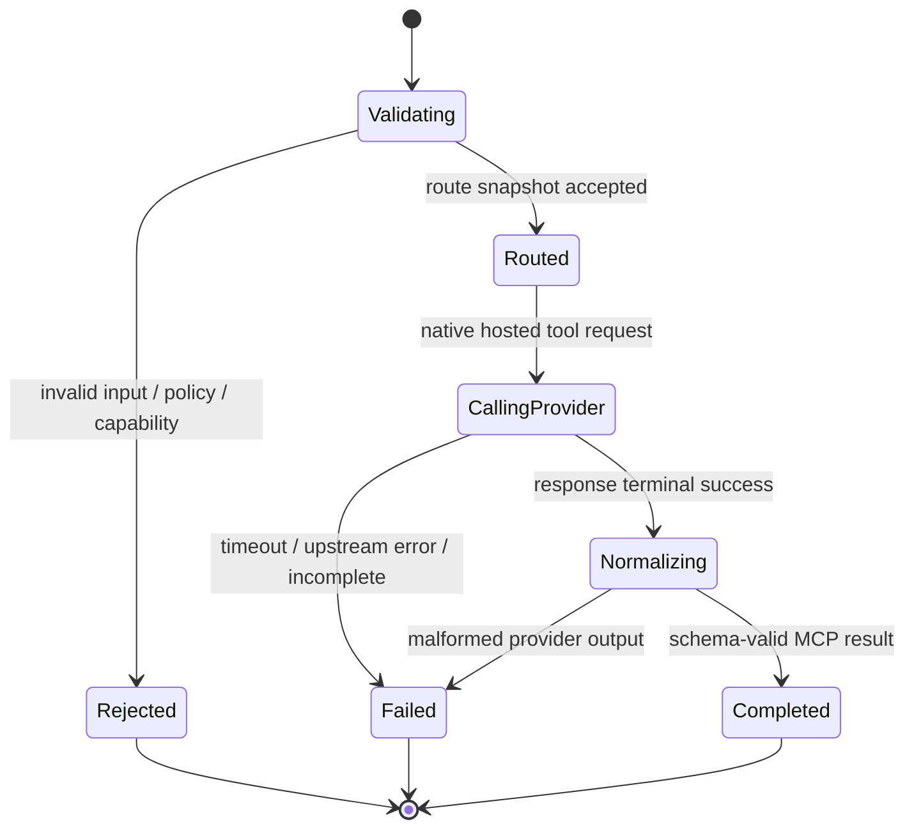

# Hosted tool 的 MCP 暴露需求

## 状态

**提议；后续能力，未实现。** 本文定义 OpenBridge 将受控 provider 的 hosted tool 封装为 MCP tool 的产品边界与验收方向。它不表示当前 proxy、provider adapter 或 MCP server 已具备此功能；实施顺序见[开发计划](../plans/development-plan.md)。

初始目标 tool 是 OpenAI Responses API 的 `web_search`，对外名称为 `openai_web_search`。其他 hosted tools 仅能在分别完成 capability、数据边界和结果契约设计后加入，不能因复用此框架而自动可用。

## 1. 问题与目标

OpenAI `web_search` 是 provider-hosted tool：OpenAI 在同一 Responses run 内执行搜索，返回 `web_search_call`、assistant message 及 `url_citation` annotation；调用方不执行工具，也不回传 `function_call_output`。

现有 OpenBridge 的职责是 OpenAI-compatible HTTP/SSE relay 和协议 bridge。它不执行模型请求的通用 function tool，也不应把 provider-hosted item 伪造成 client-side function call。因此，直接将 hosted `web_search` 交给任意 Agent client 会面临两个问题：

1. 不是所有 Agent/adapter 都能保真消费 `web_search_call`、source list 和 citation annotation；
2. 即使能够消费最终文本，也未必能把 citation 在最终用户 UI 中正确展示。

本功能提供一个受控 MCP facade：MCP server 自己调用 OpenBridge 的 provider-native hosted tool 路径，解析最终消息与 citation，并向 MCP client 返回稳定的本地 tool result。这样，Hermes 等 MCP client 只需执行常规 MCP tool loop；OpenBridge 仍持有上游 credential、route、capability、限流与审计边界。

```text
MCP client / Agent
  → tools/call openai_web_search
  → OpenBridge Hosted Tool MCP Server
  → route snapshot + native hosted-tool capability gate
  → OpenAI Responses API: tools=[{type:web_search}]
  → web_search_call + message + url_citation
  → normalized MCP ToolResult
  → Agent synthesis / client citation rendering
```

## 2. 范围与非目标

### 2.1 初始范围

- 作为 OpenBridge 受控组件提供 MCP server；首个受支持 transport 为本地 `stdio`。远程 HTTP MCP transport 需单独定义认证与部署边界。
- 暴露一个 `openai_web_search` MCP tool，调用 OpenAI Responses 原生 `web_search`。
- 通过 OpenBridge 的 `RouteSnapshot`、provider adapter、credential binding、capability gate、限流和 metadata audit 选择上游；MCP server 不复制 credential resolver 或自行持有上游 API key。
- 返回结构化搜索结论、citation、可选 source list 与安全的 OpenBridge request correlation id。
- 将 OpenAI hosted `web_search` 的结果转化为 MCP **本地 tool result**，而不是向 MCP client 暴露一条伪 Responses SSE stream。

### 2.2 明确非目标

- 不实现任意 function name → 任意 HTTP 请求的通用工具执行器。
- 不把 `web_search_call` 改写成下游 Responses `function_call`，也不产生伪造的 `function_call_output`。
- 不承诺原样透传 OpenAI response、provider item id、内部 reasoning、完整搜索上下文或网页正文。
- 不承诺 MCP client 的最终自然语言回答自动保留 citation；该客户端展示责任必须由单独的 UI/Agent integration 满足。
- 不以此功能绕过 `RouteSnapshot`、principal scope、provider capability、出站 allowlist、上下游限流或审计策略。
- 不将任意 MCP server、任意第三方搜索 API、网页抓取或内网检索自动纳入同一能力。

## 3. 术语与执行责任

| 术语 | 定义 |
|---|---|
| hosted tool | 由 provider（初期为 OpenAI）执行的工具，例如 Responses `web_search`。 |
| MCP facade | OpenBridge 提供的 MCP server；对 MCP client 看起来是本地、可调用的 tool。 |
| source run | MCP facade 发起的一次 provider Responses request。 |
| normalized result | facade 从 provider 输出中提取并按 MCP `outputSchema` 返回的稳定结果；不是原始 provider DTO。 |
| citation | 绑定在 `answer` 文本范围上的 OpenAI `url_citation`，含 URL、标题和字符范围。 |
| source list | provider 搜索过程使用或返回的完整 URL 集合；它不等同于最终答案实际引用的 citation 集合。 |

执行责任必须保持清晰：

```text
OpenAI 执行 hosted web_search。
MCP facade 执行“调用 OpenAI + 解析/规范化结果”。
MCP client 执行 openai_web_search MCP tool call。
Agent 不执行网页搜索 HTTP 请求，也不向 OpenAI 回传 tool output。
```

## 4. 目标架构与边界

### 4.1 服务边界

MCP facade 可以作为独立进程、sidecar 或 OpenBridge 受控子命令启动，但其业务实现必须复用 OpenBridge 的 route/capability/provider 边界：

```text
McpRequest
  → McpInputValidator
  → Principal + HostedToolPolicy
  → RouteSnapshot
  → HostedToolCapabilityGate
  → ProviderAdapter.execute_hosted_tool
  → HostedToolResultNormalizer
  → McpToolResult
```

禁止的实现方式：

- MCP server 从环境变量直接读取另一个未纳入 OpenBridge 控制面的 `OPENAI_API_KEY`；
- MCP request 指定任意 OpenAI `base_url`、model、header 或 credential；
- 在 facade 中复制 provider-specific HTTP、OAuth refresh 或 secret storage 逻辑；
- 把上游未解析的 JSON 直接塞入 `content` 并让 Agent 猜测 schema。

### 4.2 capability gate

每个 deployment 的 `CapabilityProfile` 至少新增或细化以下事实：

```text
supports_mcp_hosted_tool_facade: bool
supported_hosted_tool_kinds: set
hosted_tool_result_mode: native | unsupported
supports_web_search_citations: bool
supports_web_search_sources: bool
```

MCP facade 仅可在 route 选定 deployment 原生支持目标 hosted tool、相关结果字段且 principal 获得该 tool scope 时发起上游调用。否则必须在**上游调用前**返回可识别错误。

`web_search` 不能通过 Chat↔Responses bridge 获得等价性：若 route 只有 Chat 或目标 provider 不支持 OpenAI hosted web search，初版一律拒绝，不将它降级为本地 function、普通网页抓取或另一个未声明的 provider。

## 5. MCP tool 契约

### 5.1 名称与输入

首个工具名固定为 `openai_web_search`，避免与 Hermes/其他 MCP server 的通用 `web_search` 发生语义或名称混淆。

```json
{
  "name": "openai_web_search",
  "description": "Search the public web through OpenAI hosted web_search and return a cited briefing. Use for current public facts; not for private systems or actions.",
  "inputSchema": {
    "type": "object",
    "properties": {
      "query": {
        "type": "string",
        "minLength": 1,
        "maxLength": 4000,
        "description": "Focused factual web-research query."
      },
      "allowed_domains": {
        "type": "array",
        "items": { "type": "string" },
        "maxItems": 100,
        "description": "Optional domain allowlist without scheme; intersected with server policy."
      },
      "search_context_size": {
        "type": "string",
        "enum": ["low", "medium", "high"],
        "description": "Requested search depth, subject to principal policy."
      }
    },
    "required": ["query"],
    "additionalProperties": false
  }
}
```

`external_web_access`、`return_token_budget`、`background`、精确 `user_location`、provider model 和上游 URL 不属于初始 MCP input。它们分别影响网络访问、成本、异步资源、隐私或路由安全，必须由 server-side policy 决定。

### 5.2 OpenAI source run

facade 应创建一次 provider-native Responses request。示意：

```json
{
  "input": "Research the query below. Produce a concise factual answer and cite sources.\n\n<validated query>",
  "tools": [
    {
      "type": "web_search",
      "search_context_size": "<validated value>",
      "filters": { "allowed_domains": ["<policy-intersected domains>"] }
    }
  ],
  "tool_choice": "required",
  "include": ["web_search_call.action.sources"]
}
```

`tool_choice: "required"` 的目的是保证本 MCP tool 的语义是“执行网页搜索”，而不是让 source model 在无需检索时直接生成无搜索回答。调用完成后，facade 以 response-level terminal state 判定成功或失败；单个 `web_search_call` item 的状态不得单独充当整个 run 的终态。

### 5.3 输出 schema

MCP server 必须声明 `outputSchema`，并在 `structuredContent` 中返回符合该 schema 的对象；同时在 `content` 返回该对象的 JSON 序列化文本，以兼容只消费 text content 的 MCP client。

```json
{
  "type": "object",
  "properties": {
    "answer": { "type": "string" },
    "citations": {
      "type": "array",
      "items": {
        "type": "object",
        "properties": {
          "url": { "type": "string" },
          "title": { "type": "string" },
          "start_index": { "type": "integer", "minimum": 0 },
          "end_index": { "type": "integer", "minimum": 0 }
        },
        "required": ["url", "title", "start_index", "end_index"],
        "additionalProperties": false
      }
    },
    "sources": {
      "type": "array",
      "items": {
        "type": "object",
        "properties": {
          "url": { "type": "string" },
          "title": { "type": "string" }
        },
        "required": ["url"],
        "additionalProperties": false
      }
    },
    "search": {
      "type": "object",
      "properties": {
        "query": { "type": "string" },
        "used_hosted_web_search": { "type": "boolean" },
        "proxy_request_id": { "type": "string" }
      },
      "required": ["query", "used_hosted_web_search", "proxy_request_id"],
      "additionalProperties": false
    }
  },
  "required": ["answer", "citations", "sources", "search"],
  "additionalProperties": false
}
```

约束：

- `citation.start_index` / `end_index` 只相对于同一 result 的 `answer` 字符串有效；不能被解释为外层 Agent 最终改写回答的字符范围。
- `citations` 是回答中实际标注的来源；`sources` 是搜索 run 的来源集合，可能更多且不应自动视为回答证据。
- 若 provider 未返回 source list，但能返回 citations，`sources` 可以由去重 citation URL 构成；该合成必须在 audit 中标记为 `sources_derived_from_citations`。
- 不返回完整 provider response、未引用网页内容、prompt、reasoning、OAuth material 或上游 Authorization/header。

## 6. citation 与用户可见性

OpenAI 要求向最终用户展示 web-search 内容或结果时，将 inline citation 清晰、可点击地呈现。MCP facade 能保证**结果中存在结构化 citation**，但不能单独保证调用它的 Agent 会把 citation 带入最终文本。

初始策略：

1. facade 返回 `answer`、`citations` 和 `sources`；
2. tool description 要求 Agent 在使用结果生成面向用户的结论时保留相应来源；
3. 支持 MCP structured result 的 client 应独立渲染 citation，而不是依赖 Agent 重写后的字符 offset；
4. 不支持 citation rendering 的 client 必须至少保留可点击 URL 列表，或拒绝启用需要严格 citation UX 的此能力。

后续若 OpenBridge 提供自己的 Agent UI/API，必须定义从 `McpToolResult.citations` 到最终 UI 的 provenance binding；不能把 provider citation silently flatten 成无来源纯文本。

## 7. 状态、错误与审计

### 7.1 状态机



`web_search_call` 是 `CallingProvider` 内部的 provider activity record，不是 MCP client 应执行的后续 work item。MCP server 不会向 OpenAI 提交 `function_call_output`。

### 7.2 错误契约

- MCP arguments 违反 input schema：JSON-RPC invalid-params/protocol error。
- 合法请求但 policy、scope 或 capability 不允许：MCP tool result `isError: true`，使用稳定的公开错误码，例如 `hosted_tool_not_allowed`、`hosted_tool_unsupported`。
- 上游超时、429、5xx、异常 response 或 output 无法归一化：MCP tool result `isError: true`，使用 `upstream_timeout`、`upstream_rate_limited`、`upstream_failed`、`hosted_tool_result_invalid`。
- 错误结果不得泄露 upstream body、credential、cookie、内部 route、provider URL、完整 prompt 或未脱敏 stack trace。

### 7.3 审计

沿用 metadata-first 策略，至少记录：

```text
proxy_request_id
principal/key locator
MCP server/tool name
route/deployment/provider
capability decision
query length and policy outcome (not query text by default)
upstream HTTP/error class
response terminal outcome
duration / TTFT where applicable
citation count / source count
normalization mode
```

完整 query、answer、URL 或 source title 是否记录必须服从独立的内容 capture policy；默认不记录。审计不能包含 API key、OAuth material、Authorization、cookie 或完整 provider payload。

## 8. 安全与运行约束

- MCP server 必须将外部网页、搜索摘要、citation 标题和 URL 视为不可信数据；不得把网页中内容当作 server instruction。
- `allowed_domains` 只能收窄、不能扩大 principal/server policy；输入中提供的列表与 server allowlist 取交集。
- 对每 principal/MCP session 配置 invocation、并发、query length、source/result size、wall-clock timeout 与总成本预算。
- source run 必须绑定不可变 `RouteSnapshot`；运行中不因控制面变更切换 provider/deployment。
- MCP server 的上游访问只能通过 OpenBridge credential binding；不得接收用户提供的 bearer token、base URL 或 header。
- 初始 `stdio` deployment 仅授予本机受信 MCP client；未来远程 transport 必须先定义 mTLS/OAuth、tenant isolation、rate limit 和日志保留策略。

## 9. 实施切片与退出条件

此功能属于项目后续 **Phase 7**。Phase 3 capability/routing、Phase 4 principal authorization、Phase 5 metadata audit 和 Phase 6 protocol conversion 基线是进入该阶段的前置条件；它不是 Phase 6 的 built-in-tool bridge 扩展。

### Slice 1：契约与 capability

- 定义 `HostedToolKind`、`HostedToolPolicy`、`McpToolDescriptor`、`HostedToolResult` 和上文的输入/输出 schema。
- 将 `openai_web_search` 作为唯一初始 capability；缺失 native Responses/web search/citation capability 时 fail closed。
- 明确 `ConversionNotice`/audit 对 native hosted execution、source derivation 和拒绝的表示。

**退出条件**：schema 与 capability fixture 覆盖有效输入、未知字段、策略拒绝、无原生能力拒绝和不支持 tool kind；无上游调用发生在拒绝路径。

### Slice 2：OpenAI adapter 与结果规范化

- 通过受控 provider adapter 发起 Responses `web_search` source run。
- 按 response-level terminal state 处理成功/失败；提取 assistant output text、`url_citation` 和可选 source list。
- 生成 schema-valid `structuredContent` 与兼容的 text content；绝不把 hosted item 转为 local `function_call_output`。

**退出条件**：脱敏 fixture 覆盖无搜索、单/多 citation、无 source list、重复 URL、provider item `in_progress` 但 response completed、timeout、429、5xx、malformed annotation 与 response incomplete。

### Slice 3：MCP runtime、授权与可观测性

- 提供本地 stdio MCP server，并将 tool call 映射到 Slice 2 service。
- 复用 principal scope、route snapshot、rate/concurrency limit、timeout、cancellation 和 metadata audit。
- 验证 MCP `content` 与 `structuredContent` 的一致性，且错误不泄露 secret/provider internals。

**退出条件**：Hermes 或另一个 MCP reference client 可列举、调用、消费正常与错误结果；并发、取消、scope 拒绝和 secret scan 通过。

### Slice 4：citation 消费验证

- 为至少一个目标 MCP client 定义其 citation 展示/保留策略，并以集成测试验证可点击 URL 仍可获取。
- 若目标客户端不能消费 structured citation，则记录明确降级或拒绝，不以无来源文本假装完成。

**退出条件**：端到端测试证明最终 UI 或可导出结果保留可点击 citation，或对该 client 返回明确 `citation_delivery_unsupported`。

## 10. 外部依据与关联文档

- OpenAI Web search：hosted `web_search` 的 Responses 调用、`web_search_call`、`url_citation`、source list、filters、live access 与限制。<https://platform.openai.com/docs/guides/tools-web-search>
- OpenAI Function calling：本地 function call/result 的 `call_id` loop；它与 provider-hosted tool 的执行责任不同。<https://platform.openai.com/docs/guides/function-calling?api-mode=responses>
- Model Context Protocol Tools：`inputSchema`、`outputSchema`、`structuredContent`、text content、error 和 server/client security responsibilities。<https://modelcontextprotocol.io/specification/2025-06-18/server/tools>
- [初版需求](proxy-requirements.md)：OpenBridge 的控制面、安全、capability、SSE 与 audit 基线。
- [开发计划](../plans/development-plan.md)：Phase 7 的项目级前置条件和执行位置。
- [Chat/Responses 转换设计](../design/chat-responses-conversion.md)：provider-native/builtin tools 不能在缺少等价能力时静默桥接的约束。
- [当前实现说明](../implementation/current-implementation.md)：当前可运行的 native forwarding 基线；本需求不代表其已实现。
